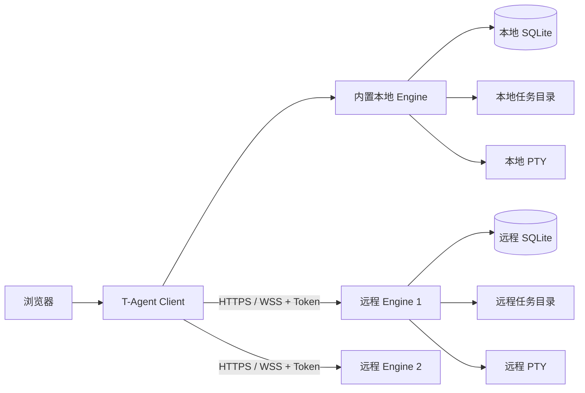

# T-Agent

T-Agent 是一个面向开发任务的组件化工作台。一个 Client 可以同时管理本机以及多台服务器上的 Engine；每个 Engine 独立保存任务、Markdown 文档、待办事项和终端会话。

Client 安装包已经内置本地 Engine，因此个人电脑只需安装一次。没有桌面界面的 Linux 服务器可以只安装独立 Engine，再使用一次性配对码或访问 Token 接入 Client。

## 项目架构



| 组件 | 职责 |
| --- | --- |
| Client | 单用户界面、本地 Engine、多 Engine 标签切换、远程连接管理、Token 加密保存、更新检查 |
| Engine | 任务和待办数据、Markdown 文件、工作目录、终端执行、Token 鉴权 |

浏览器只连接本机 Client，不会直接拿到远程 Token，也不直接请求远程 Engine。远程凭证由 Client 使用 `SESSION_SECRET` 加密后保存在 SQLite 中。

进一步的实现说明见 [组件架构](docs/ARCHITECTURE.md)，接口定义见 [Engine API](docs/ENGINE_API.md)。

## 当前功能

### Client

- 顶部标签在“本地”和多台远程 Engine 之间切换；右键远程标签可刷新、编辑或移除连接。
- 新建、编辑和删除本地任务，支持个人任务、进行中、待办、已完成分组和拖拽排序。
- 为任务管理 `DESIGN.md`、`README.md` 和 `AGENT.md`，支持 Markdown、Mermaid、目录大纲和页面内编辑。
- 管理任务待办事项、优先级、截止日期及工作目录。
- 每个任务拥有独立终端，终端在任务工作目录中启动并保存输出历史。
- 从 Finder/文件管理器或 VS Code 打开本地任务目录，生成只读分享链接。
- 顶部快速链接、PWA 安装和响应式界面。
- 自动检查更新，在设置中提示并由用户点击执行更新。

### 多 Engine

- 一个 Client 可保存并切换多台远程 Engine。
- 使用配对码或访问 Token 建立连接，显示在线、离线和认证失效状态。
- 在指定远程 Engine 上创建任务，并查看远程技术方案、README、AGENT.md 和待办清单。
- 远程任务与本地一样按个人任务、进行中、待办、已完成分组展示；支持新建和重命名自定义分组，并可通过任务右键菜单移动分组。
- “进行中/待办/已完成”是不可修改的系统分组；自定义分组只有在没有任务时才能删除。
- 通过 Client 代理使用远程交互终端；浏览器不保存 Engine Token。
- 支持修改远程连接的名称、HTTP/HTTPS 地址和端口，验证成功后才覆盖旧地址。
- Engine API 已提供任务、文档和待办的完整 CRUD，网页中的远程内容编辑界面仍在逐步补齐。

### 安全边界

- Client 不使用用户名密码，默认只监听 `127.0.0.1`，仅供安装它的本机用户访问。
- 独立 Engine 不提供用户名密码登录，只接受 Bearer Token。
- Engine 只保存 Token 的 SHA-256 哈希，Token 明文只在创建时显示一次。
- 配对码默认 10 分钟有效且只能使用一次。
- 远程终端使用 30 秒有效、只能消费一次的 WebSocket ticket。
- Engine 只允许访问 `ENGINE_WORKSPACE_ROOTS` 配置的目录。

## 系统要求

- macOS 或使用主流发行版的 Linux。
- Node.js 20 或 22+；推荐 Node.js 22 LTS。
- Client 使用 Git 安装，需要系统已安装 Git。
- `better-sqlite3` 和 `node-pty` 在无法下载预编译包时需要 Python 3、make 和支持 C++20 的编译器。

macOS 可安装命令行工具：

```bash
xcode-select --install
```

Debian/Ubuntu 可安装构建依赖：

```bash
sudo apt update
sudo apt install -y git curl nodejs npm python3 build-essential clang
```

Ubuntu 20.04 默认的 GCC 9 不识别依赖使用的 `-std=c++20` 参数；安装脚本会自动安装并改用 Clang。

## 快速安装

安装脚本会询问端口和任务目录，安装依赖后注册开机自启服务。默认安装目录是当前目录下的 `t-agent`。

### 安装 Client

Client 用于个人电脑或管理节点，内含本地 Engine。默认端口为 `3000`。
Client 按单用户方式运行，打开页面即可使用，不需要设置用户名或密码；默认仅监听本机地址。

```bash
curl -fsSL https://raw.githubusercontent.com/TorinMars/t-agent/main/bootstrap.sh | T_AGENT_MODE=client bash
```

安装结束后访问：

```text
http://127.0.0.1:3000
```

macOS 会注册 `com.tagent.client` LaunchAgent，Linux 会注册 `t-agent.service`。

### 安装独立 Engine

独立 Engine 适合部署到远程 Linux 服务器。它不安装网页 Client，也不创建网页登录账号。默认端口为 `3100`。

```bash
curl -fsSL https://raw.githubusercontent.com/TorinMars/t-agent/main/bootstrap.sh | T_AGENT_MODE=engine bash
```

首次安装结束时会输出一个 `tae_...` owner Token。它只显示一次，请立即保存；稍后需要把 Engine 地址和 Token 填入 Client。

Linux 会注册 `t-agent-engine.service`。安装脚本默认让独立 Engine 监听 `0.0.0.0`，直接开放端口时请同时配置防火墙；使用 Nginx 反向代理时建议改为只监听 `127.0.0.1`。

### 指定安装目录或分支

```bash
curl -fsSL https://raw.githubusercontent.com/TorinMars/t-agent/main/bootstrap.sh \
  | T_AGENT_MODE=client T_AGENT_DIR=/opt/t-agent T_AGENT_REF=main bash
```

### 从已有源码安装

```bash
chmod +x install.sh
./install.sh --mode client
```

非交互安装示例：

```bash
./install.sh --mode client \
  --port 13500 \
  --tasks-dir /srv/t-agent-tasks

./install.sh --mode engine \
  --port 3100 \
  --tasks-dir /srv/t-agent-tasks
```

已有 `.env` 不会被覆盖；显式提供 `--port` 或 `--tasks-dir` 时，只修改相应配置。运行 `./install.sh --help` 可查看全部参数。

## 开始使用

### 1. 创建本地任务

打开 Client 后点击“新建任务”：

1. “所属 Engine”选择“本地 Engine”。
2. 填写标题；MD 文件路径和工作路径可以留空。
3. 设置优先级、分组和截止日期后创建。

路径留空时，T-Agent 会在 `TASKS_BASE_DIR` 下创建任务目录，并自动生成：

```text
任务目录/
├── DESIGN.md
├── README.md
└── AGENT.md
```

任务详情顶部可切换技术方案、README、AGENT.md、待办和终端。终端会以该任务的工作路径作为当前目录。

### 2. 连接远程 Engine

在顶部 Engine 标签列表右侧点击 `＋`：

1. 填写 URL，例如 `http://192.168.1.20` 或 `https://engine.example.com`。
2. 使用默认 HTTP/HTTPS 端口时端口可留空；直接连接自定义端口时填写如 `3100`。
3. 填入一次性配对码 `TA-XXXX-XXXX-XXXX` 或访问 Token `tae_...`。
4. 点击“测试连接”，成功后点击“连接”。

URL 只能填写协议和主机，不要包含 `/v1` 或其他路径。使用 HTTPS 反向代理时通常填写域名，端口留空。

连接成功后，顶部会出现新的 Engine 标签。切换标签即可查看对应服务器的任务。

### 3. 创建远程任务

点击“新建任务”，在“所属 Engine”中选择目标远程节点。任务、文档和工作目录会直接创建在该 Engine 上，不会复制到 Client 本机。

远程路径指的是服务器文件系统中的路径，并且必须位于该 Engine 的 `ENGINE_WORKSPACE_ROOTS` 内。路径留空时，Engine 会在自己的 `TASKS_BASE_DIR` 下自动创建任务目录。

### 4. 管理远程连接与任务分组

当服务器 IP、端口或 HTTPS 域名发生变化时：

1. 在顶部右键对应的远程 Engine 标签。
2. 选择“编辑连接”。
3. 修改名称、URL 或端口并测试连接。
4. 保存。

Client 会沿用已保存的 Token。只有新地址能够通过 Token 访问 `/v1/info` 时才会保存，因此测试失败不会破坏原连接。

同一右键菜单可以新建任务分组。自定义分组右键可重命名或删除，任务右键可移动到其他分组。分组中还有任务时，服务端会拒绝删除；“进行中/待办/已完成”三个系统分组不提供编辑和删除操作。

### 5. 由 Client 升级远程 Engine

远程 Engine 标签的右键菜单提供“检查更新”。Client 会在服务端解密已保存的 Token，并代理以下操作，Token 不会发送给浏览器：

1. 让远程 Engine 检查配置分支上的新版本。
2. 展示当前版本、目标版本、安装方式和检查错误。
3. 经用户二次确认后触发更新，并等待 Engine 自动重启恢复。
4. 更新成功后刷新 Client 中记录的 Engine 版本和任务列表。

远程升级属于主机管理操作，连接必须使用 `owner` Token；`readonly` 和 `operator` Token 会被 Engine 拒绝。旧版 Engine 尚未提供更新 API，需要先手动升级到 `2.4.0` 或更高版本一次，此后即可由 Client 完成后续升级。Engine 必须由 systemd、launchd 或其他带自动重启能力的进程管理器托管。

## Token 与配对

### 角色

| 角色 | 用途 | 权限 |
| --- | --- | --- |
| `readonly` | 只查看任务 | 读取任务、文档和待办 |
| `operator` | 日常 Client 连接 | 读写任务、文档和待办，执行终端任务 |
| `owner` | Engine 管理员 | 所有权限，包括管理其他 Token 和执行远程升级 |

日常连接推荐使用 `operator`。首次安装生成的是 `owner` Token，应妥善保存并尽量避免在普通客户端之间复制。

### 创建一次性配对码

在 Engine 项目目录执行：

```bash
node scripts/create-engine-pairing-code.js operator
```

生成的配对码 10 分钟内有效且只能使用一次。Client 使用它完成连接后，会自动换取并加密保存正式访问 Token。

### 直接创建访问 Token

```bash
node scripts/create-engine-token.js operator "Mac Client"
```

也可以把角色改为 `readonly` 或 `owner`。

### Token 忘记或失效

Token 明文无法找回，因为 Engine 只保存哈希：

1. 在 Engine 目录重新生成配对码或访问 Token。
2. 如果 Client 中的旧连接还在但已认证失效，移除旧连接。
3. 使用原 Engine 地址和新凭证重新连接。

仅修改服务器地址时不需要新 Token，直接使用“编辑连接”即可。

Client 保存的远程 Token 依赖 `.env` 中的 `SESSION_SECRET` 解密。迁移或备份 Client 时必须同时保留 `.env` 和 `data/`。

## HTTPS 与 Nginx 反向代理

生产环境推荐让独立 Engine 仅监听本机地址，由 Nginx 提供 HTTPS/WSS。

先修改 Engine 的 `.env`：

```env
PORT=3100
ENGINE_HOST=127.0.0.1
```

Nginx 的核心代理配置如下：

```nginx
location / {
    proxy_pass http://127.0.0.1:3100;
    proxy_http_version 1.1;

    proxy_set_header Host $host;
    proxy_set_header Authorization $http_authorization;
    proxy_set_header X-Real-IP $remote_addr;
    proxy_set_header X-Forwarded-For $proxy_add_x_forwarded_for;
    proxy_set_header X-Forwarded-Proto $scheme;

    proxy_set_header Upgrade $http_upgrade;
    proxy_set_header Connection "upgrade";

    proxy_buffering off;
    proxy_cache off;
    proxy_connect_timeout 60s;
    proxy_send_timeout 3600s;
    proxy_read_timeout 3600s;
}
```

宝塔用户可在站点的“反向代理”中把目标 URL 设置为 `http://127.0.0.1:3100`，启用 WebSocket，并确认生成的站点配置包含上面的 `Upgrade`、`Connection` 和长超时设置。建议同时启用强制 HTTPS，并只保留 TLS 1.2/1.3。

检查配置和连通性：

```bash
/www/server/nginx/sbin/nginx -t
sudo systemctl restart t-agent-engine
sudo /etc/init.d/nginx reload
curl -i https://engine.example.com/v1/health
```

健康检查应返回：

```json
{"ok":true}
```

随后在 Client 中填写 `https://engine.example.com`，端口留空。

## 配置说明

复制示例配置：

```bash
cp .env.example .env
```

常用配置：

```env
PORT=3000
T_AGENT_MODE=client
SESSION_SECRET=请替换为足够长的随机字符串

# Client 内部数据归属 ID，不用于登录
SINGLE_USER_ID=local
# 免登录 Client 默认只能监听本机
HOST=127.0.0.1

# 自动创建任务文件的根目录
TASKS_BASE_DIR=/path/to/tasks

# Engine 可访问的目录，多个路径用逗号分隔
ENGINE_WORKSPACE_ROOTS=/path/to/tasks
ENGINE_NAME=my-engine
ENGINE_OWNER_ID=local
ENGINE_HOST=127.0.0.1
```

从旧版本升级时无需手动设置 `SINGLE_USER_ID`。程序会沿用原数据库中的首个账号作为唯一数据归属，旧 `.env` 中的 `AUTH_USERS` 可以暂时保留，但不再参与认证。

更新相关配置：

```env
GITHUB_VERSION_URL=https://api.github.com/repos/TorinMars/t-agent/contents/VERSION.json?ref=main
UPDATE_GITHUB_REPOSITORY=TorinMars/t-agent
UPDATE_GITHUB_REF=main
UPDATE_GIT_REMOTE=origin
UPDATE_GIT_BRANCH=main
UPDATE_CHECK_ENABLED=true
UPDATE_CHECK_INTERVAL_SECONDS=1800
UPDATE_CHECK_STARTUP_DELAY_SECONDS=30
```

私有仓库可在服务端设置 `GITHUB_TOKEN`。不要把 GitHub Token 或 Engine Token 写入网页代码、Nginx 配置或提交到 Git。

## 更新

Client 服务启动后会自动检查更新，之后默认每 30 分钟检查一次。发现新版本后，设置按钮会显示提示点：

1. 打开“设置”。
2. 点击“立即检查”查看版本。
3. 有新版本时点击更新按钮并二次确认。

Client 是单用户实例，设置页面中的本地用户可以执行更新。

- Git Client 会检查工作区、拉取配置分支并只执行 fast-forward 更新。
- 旧版归档 Client 会下载对应 GitHub 分支的安装包；建议先迁移为 Git 安装。
- 更新前会备份 SQLite，然后安装依赖、校验 `node-pty`、构建前端资源并由守护服务重新拉起。
- `.env`、数据库、日志以及任务目录不会被更新覆盖。

Git 工作区存在未提交修改或本地分支已经分叉时，网页更新会停止，防止覆盖本地代码。

独立 Engine 当前没有设置页面和网页更新按钮。升级独立 Engine 时请先备份 `.env`、`data/` 和任务目录，再按照对应版本的发布说明重新部署。

### 手动更新 Git Client

```bash
cd /path/to/t-agent
git pull --ff-only origin main
npm ci --ignore-scripts=false
npm run build:monaco
node scripts/verify-node-pty.js
```

然后按当前系统重启服务，浏览器使用 `Command/Ctrl + Shift + R` 强制刷新静态资源。

### 将安装包迁移为 Git 安装

新版安装目录可直接使用通用迁移脚本。脚本会保留 `.env`、`data/`、`logs/` 和 `tasks/`，并把原安装完整备份到同级目录：

```bash
# Client
T_AGENT_REF=main ./scripts/migrate-to-git.sh --mode client

# Engine
T_AGENT_REF=main ./scripts/migrate-to-git.sh --mode engine
```

旧安装包中还没有通用脚本时，可以先从目标分支下载脚本到当前项目的 `scripts/` 目录。迁移期间 systemd 或 launchd 服务会自动停止并重新注册；没有 systemd 的 Linux 环境需要先手动停止当前进程。确认新安装的配置和任务正常后，再自行处理备份。

## 服务管理

### macOS

macOS 没有 `systemctl`，请使用 `launchctl`：

```bash
# Client
launchctl kickstart -k "gui/$UID/com.tagent.client"

# 独立 Engine（如果安装在 macOS）
launchctl kickstart -k "gui/$UID/com.tagent.engine"
```

查看日志：

```bash
tail -f logs/stdout.log logs/stderr.log
```

### Linux systemd

```bash
# Client
sudo systemctl status t-agent
sudo systemctl restart t-agent

# 独立 Engine
sudo systemctl status t-agent-engine
sudo systemctl restart t-agent-engine
```

查看日志：

```bash
sudo journalctl -u t-agent-engine -f
```

### Linux 容器或未运行 systemd

有些 Ubuntu 容器虽然安装了 `systemctl`，但 PID 1 不是 systemd。安装脚本会自动识别这种环境、跳过服务注册，并显示手动启动命令。Engine 可以前台运行：

```bash
cd /path/to/t-agent
npm run start:engine
```

生产环境建议把上面的命令配置为容器启动命令，或者交给已有的进程管理器托管。临时后台运行可以使用：

```bash
cd /path/to/t-agent
nohup npm run start:engine >> logs/stdout.log 2>> logs/stderr.log &
```

如果旧版安装脚本在注册 systemd 服务时中断，初始 Token 可能已经生成但尚未显示。可以重新生成一个可用 Token：

```bash
cd /path/to/t-agent
node scripts/create-engine-token.js owner 'Replacement Client'
```

命令输出就是新 Token，只显示一次。

## 手动启动和开发

安装依赖：

```bash
npm install
```

启动完整 Client：

```bash
npm start
# 等价于 npm run start:client
```

只启动 Engine：

```bash
npm run start:engine
```

运行测试：

```bash
npm test
```

默认访问地址为 `http://127.0.0.1:3000`。

## 常见问题

### 远程 Engine 已添加但没有显示

先强制刷新浏览器，再检查 Client 是否成功读取远程列表：

```text
GET /api/remote-servers
```

如果接口有数据但标签仍未出现，请查看浏览器控制台和 Client 日志。

### 远程服务显示离线

在 Client 服务器上检查：

```bash
curl -i https://engine.example.com/v1/health
```

然后检查 Engine 服务和反向代理日志：

```bash
sudo journalctl -u t-agent-engine -n 100 --no-pager
tail -n 100 /www/wwwlogs/engine.example.com.error.log
```

HTTP 健康检查正常但终端失败时，通常应检查 Nginx 的 WebSocket 请求头、读超时和防火墙。

### `node-pty 未安装` 或 `posix_spawnp failed`

```bash
npm ci --ignore-scripts=false
node scripts/verify-node-pty.js
```

如果校验仍失败：

```bash
npm rebuild node-pty --ignore-scripts=false --foreground-scripts
node scripts/verify-node-pty.js
```

macOS 请先确保已安装 Xcode Command Line Tools，然后重新运行安装脚本。

### Linux 安装时报 `unrecognized command line option '-std=c++20'`

这表示 npm 未能下载原生模块的预编译包，回退源码编译后发现系统 `g++` 版本过旧。新版安装脚本会在 Debian/Ubuntu 上自动选择 Clang，在 CentOS/RHEL 上尝试安装 GCC Toolset。已有安装目录可以直接重新运行。即使上次失败时已经创建 `.env`，只要数据库从未生成过 Token，安装成功后仍会补发初始 owner Token：

```bash
cd /path/to/t-agent
./install.sh --mode engine
```

Ubuntu 20.04 也可以手动安装 Clang 后重试：

```bash
sudo apt update
sudo apt install -y clang python3 make

cd /path/to/t-agent
CC=clang CXX=clang++ ./install.sh --mode engine
```

CentOS/RHEL 8 系统也可以手动安装 GCC Toolset 12 后重试：

```bash
sudo dnf install -y gcc-toolset-12-gcc gcc-toolset-12-gcc-c++
export CC=/opt/rh/gcc-toolset-12/root/usr/bin/gcc
export CXX=/opt/rh/gcc-toolset-12/root/usr/bin/g++

cd /path/to/t-agent
./install.sh --mode engine
```

`prebuild-install` 的 deprecated 警告和 npm 新版本提示不是此次编译失败的原因。

### 日志反复出现 `VERSION_URL_NOT_CONFIGURED`

在 `.env` 中补充 `GITHUB_VERSION_URL` 和更新仓库配置，或暂时关闭检查：

```env
UPDATE_CHECK_ENABLED=false
```

修改 `.env` 后需要重启服务。

## 数据与备份

建议备份：

```text
.env             # 单用户 ID、SESSION_SECRET、更新来源
data/            # SQLite、会话、远程连接和更新状态
tasks/           # 默认任务工作目录；自定义目录需单独备份
logs/            # 可选，运行日志
```

不要只复制 `data/` 而丢失 `.env`，否则 Client 可能无法解密已经保存的远程 Token。

## 卸载

以下操作会停止服务并永久删除安装目录、配置、数据库、日志和默认任务目录。脚本会先列出目标，并要求输入 `UNINSTALL` 确认：

```bash
curl -fsSL https://raw.githubusercontent.com/TorinMars/t-agent/main/uninstall.sh | bash
```

自定义安装目录：

```bash
curl -fsSL https://raw.githubusercontent.com/TorinMars/t-agent/main/uninstall.sh \
  | T_AGENT_DIR=/opt/t-agent bash
```

## 目录结构

```text
t-agent/
├── apps/engine/      # 独立 Engine 入口
├── db/               # SQLite Schema 和会话存储
├── docs/             # 架构及 Engine API 文档
├── lib/              # Token、终端历史等基础组件
├── middleware/       # Session 与 Engine Token 鉴权
├── public/           # Client 前端静态资源
├── routes/           # Client 与 Engine HTTP/WebSocket 路由
├── scripts/          # Token、迁移、构建和诊断脚本
├── services/         # Engine、远程连接及更新业务组件
├── data/             # 运行数据，不提交 Git
├── logs/             # 服务日志，不提交 Git
└── tasks/            # 默认任务工作目录，不提交 Git
```

## License

仓库暂未声明开源许可证。未经授权，请勿假定代码可以被复制、分发或用于商业发布。
