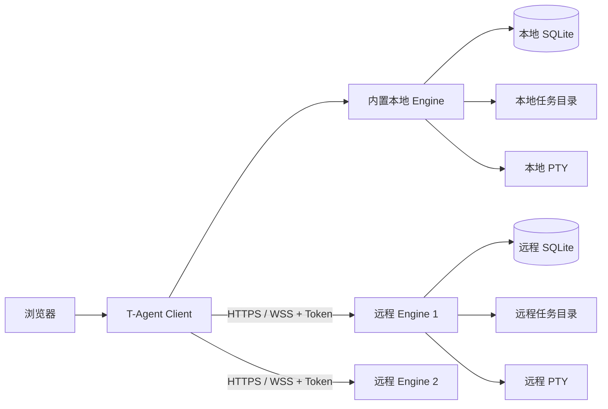

# T-Agent

终端复制：Mac 在交互式程序启用鼠标模式时，按住 Option 拖选，再用 Cmd+C 或工具栏“复制选中内容”；其他平台使用 Shift 拖选及 Ctrl+Shift+C。Ctrl+C 仍用于中断。程序发出的 OSC 52 请求不会直接写入剪贴板，需点击“查看程序复制请求”、查看内容后确认。请求最多 64 KiB、保留 60 秒，不读取系统剪贴板，也不重复处理历史回放中的请求。

Git 更新遇到本地未提交修改时，可在更新确认框勾选“强制更新”。程序先备份数据库，再将代码修改（含未跟踪且未忽略的文件）保存到 Git stash，之后快进更新；不会自动恢复修改。可用 `git stash list` 和 `git stash show -p <备份引用>` 查看备份。被 Git 忽略的配置、任务和数据库保留；已提交的分叉不会强制覆盖。配置或数据被 Git 跟踪时，会拒绝强制更新。

T-Agent 是一个面向开发任务的组件化工作台。一个 Client 可以同时管理本机以及多台服务器上的 Engine；每个 Engine 独立保存任务、Markdown 文档、待办事项和终端会话。

Client 安装包已经内置本地 Engine，因此个人电脑只需安装一次。没有桌面界面的 Linux 服务器可以只安装独立 Engine，再使用一次性配对码或访问 Token 接入 Client。

独立 Engine 同时支持原生安装和 Docker Compose 部署；Docker 镜像固定 Node.js 与原生模块编译环境，宿主机无需安装 Node/npm/C++ 工具链。

## 项目架构



| 组件 | 职责 |
| --- | --- |
| Client | 单用户界面、本地 Engine、多 Engine 标签切换、远程连接管理、Token 加密保存、更新检查 |
| Engine | 任务和待办数据、Markdown 文件、工作目录、终端执行、Token 鉴权 |

浏览器只连接本机 Client，不会直接拿到远程 Token，也不直接请求远程 Engine。远程凭证由 Client 使用 `SESSION_SECRET` 加密后保存在 SQLite 中。

进一步的实现说明见 [组件架构](docs/ARCHITECTURE.md)，接口定义见 [Engine API](docs/ENGINE_API.md)。

## 当前功能

### Client

- 左侧引擎导航支持收起为窄条并记住状态，悬停可查看完整名称；在“默认”和多台远程 Engine 之间切换；右键远程标签可刷新、编辑或移除连接。
- 新建、编辑和删除本地任务，支持个人任务、进行中、待办、已完成分组和拖拽排序。
- 为任务管理 `DESIGN.md`、`README.md` 和 `AGENTS.md`，支持 Markdown、Mermaid、目录大纲和页面内编辑。
- 本地、远程和分享页面采用统一的 Markdown 阅读样式：舒适的正文宽度、清晰的标题层级、可横向滚动的表格，以及带语言标识和复制按钮的深色语法高亮代码块。未标注或不支持的代码语言按纯文本展示。修改高亮模块后运行 `npm run build:markdown` 生成随应用分发的本地脚本。
- 管理任务待办事项、优先级、截止日期及工作目录。
- 每个任务支持多个独立终端，点击“新开终端”创建 Shell，并通过终端标签切换；各终端从任务工作目录启动，分别保存输出历史。
- 从 Finder/文件管理器或 VS Code 打开本地任务目录，生成只读分享链接。
- 快捷链接栏默认隐藏，保留已有链接数据；支持 PWA 安装；电脑和手机统一使用 `/web` 的 最小宽度 1280px、大屏横向铺满、普通浏览器最大高度 1200px、安装的 Chrome 应用及全屏模式宽高随实际窗口铺满，避免窄窗口裁切终端 的桌面页面，支持浏览器缩放和手机双指缩放；旧 `/h5` 地址跳转到 `/web`。
- 自动检查更新，在设置中提示并由用户点击执行更新。

### 多 Engine

- 一个 Client 可保存并切换多台远程 Engine。
- 使用配对码或访问 Token 建立连接，显示在线、离线和认证失效状态。
- 在指定远程 Engine 上创建任务，并查看远程技术方案、README、AGENTS.md 和待办清单。
- 远程任务与本地一样按个人任务、进行中、待办、已完成分组展示；支持新建和重命名自定义分组，并可通过任务右键菜单移动分组。
- “进行中/待办/已完成”是不可修改的系统分组；自定义分组只有在没有任务时才能删除。
- 通过 Client 代理使用远程交互终端；浏览器不保存 Engine Token。
- 支持修改远程连接的名称、HTTP/HTTPS 地址和端口，验证成功后才覆盖旧地址。
- Engine API 已提供任务、文档和待办的完整 CRUD，网页中的远程内容编辑界面仍在逐步补齐。

### 安全边界

- Client 不使用用户名密码，电脑和手机浏览器必须先绑定身份验证器，再以 6 位 TOTP 动态验证码登录；未绑定不能使用业务页面或浏览器接口。
- 首次绑定仅允许本机通过 localhost 地址直接扫码，无需初始密码或初始化码；手机、局域网及反向代理访问在未绑定时只提示先在本机绑定，避免其他人抢先绑定。绑定密钥加密保存，恢复码仅保存哈希；会话有效期 30 天，使用期间自动续期，支持主动退出、验证码防重放和认证限流。
- Client 默认只监听 `127.0.0.1`；手机访问需显式开放局域网监听或配置 HTTPS 反向代理。
- 独立 Engine 不提供用户名密码登录，只接受 Bearer Token。
- Engine 只保存 Token 的 SHA-256 哈希，Token 明文只在创建时显示一次。
- 配对码默认 10 分钟有效且只能使用一次。
- 远程终端使用 30 秒有效、只能消费一次的 WebSocket ticket。
- Engine 接受任务指定的任意绝对工作目录；持有写权限的 Token 因而具备在 Engine 运行账号权限范围内创建和修改任务文件的能力。

## 系统要求

- macOS 或使用主流发行版的 Linux。
- Node.js 20 或 22+；推荐 Node.js 22 LTS。
- Client 使用 Git 安装，需要系统已安装 Git。
- `better-sqlite3` 和 `node-pty` 在无法下载预编译包时需要 Python 3、make 和支持 C++20 的编译器。

macOS 可安装命令行工具：

```bash
xcode-select --install
```

Debian/Ubuntu 可安装构建依赖：

```bash
sudo apt update
sudo apt install -y git curl nodejs npm python3 build-essential clang
```

Ubuntu 20.04 默认的 GCC 9 不识别依赖使用的 `-std=c++20` 参数；安装脚本会自动安装并改用 Clang。

## 快速安装

安装脚本会询问端口和任务目录，安装依赖后注册开机自启服务。默认安装目录是当前目录下的 `t-agent`。

### 安装 Client

Client 用于个人电脑或管理节点，内含本地 Engine。默认端口为 `3000`。
Client 按单用户方式运行，不需要设置用户名或密码；首次打开必须绑定身份验证器。默认仅监听本机地址。

```bash
curl -fsSL https://raw.githubusercontent.com/TorinMars/t-agent/main/bootstrap.sh | T_AGENT_MODE=client bash
```

安装结束后访问：

```text
http://127.0.0.1:3000
```

macOS 会注册 `com.tagent.client` LaunchAgent，Linux 会注册 `t-agent.service`。

安装完成后，终端末尾会显示“请在浏览器打开”及访问 URL（默认 `http://127.0.0.1:3000`，以安装配置为准）。使用 `--no-service` 或系统不支持自动注册服务时，会先提示手动启动命令，启动后再访问该地址。

### 身份验证器与手机访问

新安装和旧版本升级初始都没有身份验证器绑定。再次打开客户端页面时会提示“必须绑定身份验证器”，未绑定不能访问任务、设置或终端；没有跳过绑定的免登录入口。

1. 在安装 Client 的电脑上打开 `http://127.0.0.1:3000/auth/setup`（端口以实际配置为准），直接显示绑定二维码，无需初始密码或初始化码。首次绑定必须直连本机 localhost 地址，不能从手机、局域网地址或反向代理初始化；这些入口只提示先在本机绑定。已绑定后重启不会取消绑定。
2. 使用 Google Authenticator、Microsoft Authenticator 或兼容应用扫码；同一手机可点击“在身份验证器中打开”，也可手动添加密钥（基于时间、6 位、30 秒）。输入验证器生成的验证码完成绑定。
3. 下载并安全保存页面显示的 8 组一次性恢复码。恢复码只显示一次、每组只能使用一次。验证码已使用时，需等待下一组再登录另一设备。
4. 手机与 Client 在同一局域网时，将 Client `.env` 的 `HOST` 改为 `0.0.0.0` 并重启服务。手机浏览器打开 `http://电脑的局域网IP:3000/web`（端口以实际配置为准），与电脑使用相同页面。手机可双指放大缩小、拖动查看，首页 `/` 不再按设备跳转。

默认生产部署要求 HTTPS/WSS；可信内网可显式开启 `CLIENT_ALLOW_HTTP=true`。公网使用 HTTPS/WSS 反向代理，并用防火墙限制来源。身份验证器登录会话 30 天有效，使用期间自动续期，连续 30 天未使用才过期，新设备、会话过期或主动退出后需要重新验证。登录设置中可更换身份验证器；丢失验证器时使用恢复码登录并重新绑定，更换后旧验证器、旧恢复码和其他设备会话立即失效。退出登录只断开网页终端连接，不终止服务端正在运行的程序。

`SESSION_SECRET` 必须是至少 32 个字符的随机密钥，并在重启与升级间保持不变。安装脚本会自动生成；弱密钥会拒绝绑定。请随数据库安全备份该密钥，否则无法解密已有绑定及远程连接 Token。

### 安装独立 Engine

独立 Engine 适合部署到远程 Linux 服务器。它不安装网页 Client，也不创建网页登录账号。默认端口为 `3100`。

```bash
curl -fsSL https://raw.githubusercontent.com/TorinMars/t-agent/main/bootstrap.sh | T_AGENT_MODE=engine bash
```

首次安装结束时会输出一个 `tae_...` owner Token。它只显示一次，请立即保存；稍后需要把 Engine 地址和 Token 填入 Client。

Linux 会注册 `t-agent-engine.service`。独立 Engine 固定监听 `0.0.0.0`，以便外部 Client 连接；请同时配置防火墙、访问 Token，并优先通过 HTTPS/WSS 对外提供服务。

### 使用 Docker 启动 Client

远程服务器一键启动（替换域名，提前安装 Docker Engine、Docker Compose v2 和 Git）：

```bash
curl -fsSL https://raw.githubusercontent.com/TorinMars/t-agent/main/docker-client.sh | bash -s -- --domain agent.example.com
```

首次安装会提示任务工作目录、宿主机端口及是否允许远程连接；已有安装可加 `--configure` 重新选择；可信内网可加 `--allow-http yes` 启用 HTTP 登录（默认关闭）。脚本准备独立 Codex 副本并等待 Client 健康，容器就绪后直接引导扫码绑定身份验证器，已有绑定则跳过，结束后显示访问地址；HTTPS 反向代理需按部署文档配置。

也可按以下步骤手动启动：

```bash
cp docker/client.env.example docker/client.env
mkdir -p "$HOME/.torin/t-agent-client/data" "$HOME/.torin/t-agent-client/tasks"
./scripts/docker-client-copy-codex.sh "$HOME/.torin/t-agent-client/codex"
docker compose --env-file docker/client.env -f compose.client.yml up -d client
```

Client 镜像默认包含 Codex，首次部署复制宿主机 `~/.codex` 到 Client 专用副本，后续更新保留副本，不与宿主机或 Engine 共用原目录。配置 HTTPS 反向代理后，运行 `docker compose --env-file docker/client.env -f compose.client.yml exec client node scripts/client-auth-setup.js` 完成首次绑定，再通过域名登录。完整命令、Nginx 示例、持久化与更新步骤见 [Docker Client 部署](docs/DOCKER_CLIENT.md)。

### 使用 Docker 安装独立 Engine

Docker 方式只需要 Docker Engine 与 Docker Compose v2，默认从 GHCR 拉取已构建镜像：

```bash
git clone https://github.com/TorinMars/t-agent.git
cd t-agent
cp docker/engine.env.example docker/engine.env
mkdir -p "$HOME/.torin/t-agent-data/data" "$HOME/.torin/t-agent-data/tasks" "$HOME/.torin/t-agent-data/codex"
docker compose --env-file docker/engine.env -f compose.engine.yml up -d
docker compose --env-file docker/engine.env -f compose.engine.yml \
  exec engine node scripts/create-engine-token.js owner 'Initial Client'
```

最后一条命令输出首次连接所需的 owner Token。数据库、任务和 Codex 配置分别保存在宿主机的 `~/.torin/t-agent-data/data/`、`tasks/` 与 `codex/`，容器替换后不会丢失。镜像已内置 Codex CLI，在 Engine 终端中运行 `codex` 并完成首次登录即可使用。完整的目录挂载、旧数据迁移、自动更新和终端工具说明见 [Docker Engine 部署](docs/DOCKER_ENGINE.md)。

### 指定安装目录或分支

```bash
curl -fsSL https://raw.githubusercontent.com/TorinMars/t-agent/main/bootstrap.sh \
  | T_AGENT_MODE=client T_AGENT_DIR=/opt/t-agent T_AGENT_REF=main bash
```

### 从已有源码安装

```bash
chmod +x install.sh
./install.sh --mode client
```

非交互安装示例：

```bash
./install.sh --mode client \
  --port 13500 \
  --tasks-dir /srv/t-agent-tasks

./install.sh --mode engine \
  --port 3100 \
  --tasks-dir /srv/t-agent-tasks
```

已有 `.env` 不会被覆盖；显式提供 `--port` 或 `--tasks-dir` 时，只修改相应配置。运行 `./install.sh --help` 可查看全部参数。

## 开始使用

### 1. 创建本地任务

打开 Client 后点击“新建任务”：

1. “所属 Engine”选择“本地 Engine”。
2. 填写标题；MD 文件路径和工作路径可以留空。
3. 设置优先级、分组和截止日期后创建。

路径留空时，T-Agent 会在 `TASKS_BASE_DIR` 下创建任务目录，并自动生成：

```text
任务目录/
├── DESIGN.md
├── README.md
├── AGENTS.md
└── CLAUDE.md
```

任务详情顶部可切换技术方案、README、AGENTS.md、待办和终端。终端会以该任务的工作路径作为当前目录。终端标签可切换同一任务的多个独立 Shell；页面内按任务及终端分别缓存画面、滚动位置和连接，普通切换不重复连接或重放历史，也不会终止后台程序。刷新页面后可再次选择已创建的终端。终端底部提供紧凑功能键栏：Esc、Tab、Ctrl、Command、Option、Shift、方向键、Enter 和退格。点击修饰键后再点击功能键或输入字母可组成组合键，发送一次后自动释放；“Option + ↑”按钮直接发送 Alt+Up（`ESC [ 1 ; 3 A`）。Command 使用扩展键盘协议的 Super 修饰键，需要终端内程序支持，不触发操作系统快捷键。终端顶部提供五个操作：

- “新开终端”在任务工作目录中新建独立 Shell，保留已有终端。

- “重新打开”只重新建立浏览器连接，保留当前 Shell 进程、所在目录和历史。
- “关闭当前终端”会终止当前 Shell 及其中运行的程序，并保留标签和已记录的输出历史。
- “删除当前终端”会终止新建终端的 Shell，永久删除标签和历史记录，随后切回默认终端；默认终端不能删除。远程任务需要 Engine 同时支持此操作。
- “从工作目录重新打开”会终止当前 Shell、清空旧终端历史，并以任务配置的工作目录启动全新 Shell。

### 2. 连接远程 Engine

在左侧 Engine 导航底部点击 `＋ 连接远程`：

1. 填写 URL，例如 `http://192.168.1.20` 或 `https://engine.example.com`。
2. 使用默认 HTTP/HTTPS 端口时端口可留空；直接连接自定义端口时填写如 `3100`。
3. 填入一次性配对码 `TA-XXXX-XXXX-XXXX` 或访问 Token `tae_...`。
4. 点击“测试连接”，成功后点击“连接”。

URL 只能填写协议和主机，不要包含 `/v1` 或其他路径。使用 HTTPS 反向代理时通常填写域名，端口留空。

连接成功后，左侧会出现新的 Engine 标签。每个标签会显示该 Engine 的当前版本；Client 启动时会自动探测远程版本，并在一分钟内对重复加载做节流。切换标签即可查看对应服务器的任务。

### 3. 创建远程任务

点击“新建任务”，在“所属 Engine”中选择目标远程节点，然后可在“远程工作目录”中填写服务器上的绝对路径。任务、文档和工作目录会直接创建在该 Engine 上，不会复制到 Client 本机；指定目录不存在时 Engine 会自动创建。

每个任务都可以单独指定工作目录，不再受工作区根目录白名单限制。只填写工作目录时，技术方案默认使用该目录下的 `DESIGN.md`；路径留空时，Engine 会在自己的 `TASKS_BASE_DIR` 下自动创建任务目录。远程路径必须是绝对路径，并且 Engine 进程账号需要拥有相应目录的读写权限。

远程终端同样支持新开多个独立终端、重新打开、关闭以及从工作目录重新打开。关闭和重新启动仅影响当前终端标签。多终端功能需要 Engine 提供 `terminal:multiple` 能力；旧版 Engine 仍可使用默认终端，新开终端时会提示升级。终端控制接口从 `2.5.0` 开始提供；控制旧 Engine 时，Client 会提示先升级，不会把控制内容写入 Shell。

### 4. 管理远程连接与任务分组

当服务器 IP、端口或 HTTPS 域名发生变化时：

1. 在左侧右键对应的远程 Engine 标签。
2. 选择“编辑连接”。
3. 修改名称、URL 或端口并测试连接。
4. 保存。

Client 会沿用已保存的 Token。只有新地址能够通过 Token 访问 `/v1/info` 时才会保存，因此测试失败不会破坏原连接。

同一右键菜单可以新建任务分组。自定义分组右键可重命名或删除，任务右键可移动到其他分组。分组中还有任务时，服务端会拒绝删除；“进行中/待办/已完成”三个系统分组不提供编辑和删除操作。

### 5. 由 Client 升级远程 Engine

远程 Engine 标签的右键菜单提供“检查更新”。Client 会在服务端解密已保存的 Token，并代理以下操作，Token 不会发送给浏览器：

1. 让远程 Engine 检查配置分支上的新版本。
2. 展示当前版本、目标版本、安装方式和检查错误。
3. 经用户二次确认后触发更新，并等待 Engine 自动重启恢复。
4. 更新成功后刷新 Client 中记录的 Engine 版本和任务列表。

远程升级属于主机管理操作，连接必须使用 `owner` Token；`readonly` 和 `operator` Token 会被 Engine 拒绝。旧版 Engine 尚未提供更新 API，需要先手动升级到 `2.4.0` 或更高版本一次，此后即可由 Client 完成后续升级。Engine 必须由 systemd、launchd 或其他带自动重启能力的进程管理器托管。

## Token 与配对

### 角色

| 角色 | 用途 | 权限 |
| --- | --- | --- |
| `readonly` | 只查看任务 | 读取任务、文档和待办 |
| `operator` | 日常 Client 连接 | 读写任务、文档和待办，执行终端任务 |
| `owner` | Engine 管理员 | 所有权限，包括管理其他 Token 和执行远程升级 |

日常连接推荐使用 `operator`。首次安装生成的是 `owner` Token，应妥善保存并尽量避免在普通客户端之间复制。

### 创建一次性配对码

在 Engine 项目目录执行：

```bash
node scripts/create-engine-pairing-code.js operator
```

生成的配对码 10 分钟内有效且只能使用一次。Client 使用它完成连接后，会自动换取并加密保存正式访问 Token。

### 直接创建访问 Token

```bash
node scripts/create-engine-token.js operator "Mac Client"
```

也可以把角色改为 `readonly` 或 `owner`。

### Token 忘记或失效

Token 明文无法找回，因为 Engine 只保存哈希：

1. 在 Engine 目录重新生成配对码或访问 Token。
2. 如果 Client 中的旧连接还在但已认证失效，移除旧连接。
3. 使用原 Engine 地址和新凭证重新连接。

仅修改服务器地址时不需要新 Token，直接使用“编辑连接”即可。

Client 保存的远程 Token 依赖 `.env` 中的 `SESSION_SECRET` 解密。迁移或备份 Client 时必须同时保留 `.env` 和 `data/`。

## HTTPS 与 Nginx 反向代理

生产环境推荐由 Nginx 为独立 Engine 提供 HTTPS/WSS。Engine 固定监听 `0.0.0.0`，Nginx 仍通过 `127.0.0.1:3100` 回源；请用服务器防火墙阻止公网直接访问原始端口。

Nginx 的核心代理配置如下：

```nginx
location / {
    proxy_pass http://127.0.0.1:3100;
    proxy_http_version 1.1;

    proxy_set_header Host $host;
    proxy_set_header Authorization $http_authorization;
    proxy_set_header X-Real-IP $remote_addr;
    proxy_set_header X-Forwarded-For $proxy_add_x_forwarded_for;
    proxy_set_header X-Forwarded-Proto $scheme;

    proxy_set_header Upgrade $http_upgrade;
    proxy_set_header Connection "upgrade";

    proxy_buffering off;
    proxy_cache off;
    proxy_connect_timeout 60s;
    proxy_send_timeout 3600s;
    proxy_read_timeout 3600s;
}
```

宝塔用户可在站点的“反向代理”中把目标 URL 设置为 `http://127.0.0.1:3100`，启用 WebSocket，并确认生成的站点配置包含上面的 `Upgrade`、`Connection` 和长超时设置。建议同时启用强制 HTTPS，并只保留 TLS 1.2/1.3。

检查配置和连通性：

```bash
/www/server/nginx/sbin/nginx -t
sudo systemctl restart t-agent-engine
sudo /etc/init.d/nginx reload
curl -i https://engine.example.com/v1/health
```

健康检查应返回：

```json
{"ok":true}
```

随后在 Client 中填写 `https://engine.example.com`，端口留空。

## 配置说明

复制示例配置：

```bash
cp .env.example .env
```

常用配置：

```env
PORT=3000
T_AGENT_MODE=client
SESSION_SECRET=请替换为足够长的随机字符串

# Client 内部数据归属 ID，不用于登录
SINGLE_USER_ID=local
# 默认监听本机；手机同局域网访问时可改为 0.0.0.0
HOST=127.0.0.1

# 自动创建任务文件的根目录
TASKS_BASE_DIR=/path/to/tasks

ENGINE_NAME=my-engine
ENGINE_OWNER_ID=local
# 独立 Engine 固定监听 0.0.0.0，无需配置 ENGINE_HOST
```

从旧版本升级时无需手动设置 `SINGLE_USER_ID`。程序会沿用原数据库中的首个账号作为唯一数据归属，旧 `.env` 中的 `AUTH_USERS` 可以暂时保留，但不再参与认证。

更新相关配置：

```env
GITHUB_VERSION_URL=https://api.github.com/repos/TorinMars/t-agent/contents/VERSION.json?ref=main
UPDATE_GITHUB_REPOSITORY=TorinMars/t-agent
UPDATE_GITHUB_REF=main
UPDATE_GIT_REMOTE=origin
UPDATE_GIT_BRANCH=main
UPDATE_CHECK_ENABLED=true
UPDATE_CHECK_INTERVAL_SECONDS=1800
UPDATE_CHECK_STARTUP_DELAY_SECONDS=30
```

私有仓库可在服务端设置 `GITHUB_TOKEN`。不要把 GitHub Token 或 Engine Token 写入网页代码、Nginx 配置或提交到 Git。

## 更新

Client 服务启动后会自动检查更新，之后默认每 30 分钟检查一次。发现新版本后，设置按钮会显示提示点：

1. 打开“设置”。
2. 点击“立即检查”查看版本。
3. 有新版本时点击更新按钮并二次确认。

Client 是单用户实例，设置页面中的本地用户可以执行更新。

- Git Client 会检查工作区、拉取配置分支并只执行 fast-forward 更新。
- 旧版归档 Client 会下载对应 GitHub 分支的安装包；建议先迁移为 Git 安装。
- 更新前会备份 SQLite。Git 安装的纯前端、静态资源和文档更新会直接完成，不安装依赖、不重启服务，也不自动刷新页面，保留现有 Shell 连接；用户可稍后刷新加载新界面。
- 服务端、引擎、依赖、构建脚本或 API/数据库版本变化时，仍安装依赖、校验 `node-pty`、构建前端资源并重启服务。确认界面会说明是否需要重启。归档安装仍使用完整更新流程。
- 更新范围与当前进程启动时的提交比较，避免上次失败后遗留的服务端变化被误判为无需重启。
- `.env`、数据库、日志以及任务目录不会被更新覆盖。

Git 工作区存在未提交修改或本地分支已经分叉时，网页更新会停止，防止覆盖本地代码。

更新过程会在服务日志中输出带 `[update]` 前缀的时间、阶段、命令耗时，以及 npm 安装和前端构建的实时输出；失败时记录退出码和错误详情。PM2 部署可用 `pm2 logs t-agent` 查看（使用部署时的 `PM2_HOME`），systemd 部署可查看对应服务的 journal 日志。在线更新需要的 `esbuild` 随正式依赖安装，生产环境省略开发依赖也能完成构建。

独立 Engine 当前没有设置页面和网页更新按钮。升级独立 Engine 时请先备份 `.env`、`data/` 和任务目录，再按照对应版本的发布说明重新部署。

### 手动更新 Git Client

```bash
cd /path/to/t-agent
git pull --ff-only origin main
npm ci --ignore-scripts=false
npm run build:monaco
node scripts/verify-node-pty.js
```

然后按当前系统重启服务，浏览器使用 `Command/Ctrl + Shift + R` 强制刷新静态资源。

### 将安装包迁移为 Git 安装

新版安装目录可直接使用通用迁移脚本。脚本会保留 `.env`、`data/`、`logs/` 和 `tasks/`，并把原安装完整备份到同级目录：

```bash
# Client
T_AGENT_REF=main ./scripts/migrate-to-git.sh --mode client

# Engine
T_AGENT_REF=main ./scripts/migrate-to-git.sh --mode engine
```

旧安装包中还没有通用脚本时，可以先从目标分支下载脚本到当前项目的 `scripts/` 目录。迁移期间 systemd 或 launchd 服务会自动停止并重新注册；没有 systemd 的 Linux 环境需要先手动停止当前进程。确认新安装的配置和任务正常后，再自行处理备份。

## 服务管理

### macOS

macOS 没有 `systemctl`，请使用 `launchctl`：

```bash
# Client
launchctl kickstart -k "gui/$UID/com.tagent.client"

# 独立 Engine（如果安装在 macOS）
launchctl kickstart -k "gui/$UID/com.tagent.engine"
```

查看日志：

```bash
tail -f logs/stdout.log logs/stderr.log
```

### Linux systemd

```bash
# Client
sudo systemctl status t-agent
sudo systemctl restart t-agent

# 独立 Engine
sudo systemctl status t-agent-engine
sudo systemctl restart t-agent-engine
```

查看日志：

```bash
sudo journalctl -u t-agent-engine -f
```

### Linux 容器或未运行 systemd

有些 Ubuntu 容器虽然安装了 `systemctl`，但 PID 1 不是 systemd。安装脚本会自动识别这种环境、跳过服务注册，并显示手动启动命令。Engine 可以前台运行：

```bash
cd /path/to/t-agent
npm run start:engine
```

生产环境可以使用项目提供的 [Docker Engine 部署](docs/DOCKER_ENGINE.md)，或者把上面的命令交给已有的进程管理器托管。临时后台运行可以使用：

```bash
cd /path/to/t-agent
nohup npm run start:engine >> logs/stdout.log 2>> logs/stderr.log &
```

如果旧版安装脚本在注册 systemd 服务时中断，初始 Token 可能已经生成但尚未显示。可以重新生成一个可用 Token：

```bash
cd /path/to/t-agent
node scripts/create-engine-token.js owner 'Replacement Client'
```

命令输出就是新 Token，只显示一次。

## 手动启动和开发

安装依赖：

```bash
npm install
```

启动完整 Client：

```bash
npm start
# 等价于 npm run start:client
```

只启动 Engine：

```bash
npm run start:engine
```

运行测试：

```bash
npm ci --include=dev
npx playwright install chromium
npm test
```

Playwright 固定为兼容 macOS 13 的 1.58.2。全量测试包含五项真实 Chromium 浏览器回归，开发依赖包含 Playwright、xterm 及 Fit 插件。Linux CI 可使用 `npx playwright install --with-deps chromium` 安装系统依赖；也可通过 `CHROME_PATH` 指定现有 Chromium 可执行文件。

默认访问地址为 `http://127.0.0.1:3000`。

## 常见问题

### 远程 Engine 已添加但没有显示

先强制刷新浏览器，再检查 Client 是否成功读取远程列表：

```text
GET /api/remote-servers
```

如果接口有数据但标签仍未出现，请查看浏览器控制台和 Client 日志。

### 远程服务显示离线

在 Client 服务器上检查：

```bash
curl -i https://engine.example.com/v1/health
```

然后检查 Engine 服务和反向代理日志：

```bash
sudo journalctl -u t-agent-engine -n 100 --no-pager
tail -n 100 /www/wwwlogs/engine.example.com.error.log
```

HTTP 健康检查正常但终端失败时，通常应检查 Nginx 的 WebSocket 请求头、读超时和防火墙。

### `node-pty 未安装` 或 `posix_spawnp failed`

```bash
npm ci --ignore-scripts=false
node scripts/verify-node-pty.js
```

如果校验仍失败：

```bash
npm rebuild node-pty --ignore-scripts=false --foreground-scripts
node scripts/verify-node-pty.js
```

macOS 请先确保已安装 Xcode Command Line Tools，然后重新运行安装脚本。

### Linux 安装时报 `unrecognized command line option '-std=c++20'`

这表示 npm 未能下载原生模块的预编译包，回退源码编译后发现系统 `g++` 版本过旧。新版安装脚本会在 Debian/Ubuntu 上自动选择 Clang，在 CentOS/RHEL 上尝试安装 GCC Toolset。已有安装目录可以直接重新运行。即使上次失败时已经创建 `.env`，只要数据库从未生成过 Token，安装成功后仍会补发初始 owner Token：

```bash
cd /path/to/t-agent
./install.sh --mode engine
```

Ubuntu 20.04 也可以手动安装 Clang 后重试：

```bash
sudo apt update
sudo apt install -y clang python3 make

cd /path/to/t-agent
CC=clang CXX=clang++ ./install.sh --mode engine
```

CentOS/RHEL 8 系统也可以手动安装 GCC Toolset 12 后重试：

```bash
sudo dnf install -y gcc-toolset-12-gcc gcc-toolset-12-gcc-c++
export CC=/opt/rh/gcc-toolset-12/root/usr/bin/gcc
export CXX=/opt/rh/gcc-toolset-12/root/usr/bin/g++

cd /path/to/t-agent
./install.sh --mode engine
```

`prebuild-install` 的 deprecated 警告和 npm 新版本提示不是此次编译失败的原因。

### 日志反复出现 `VERSION_URL_NOT_CONFIGURED`

在 `.env` 中补充 `GITHUB_VERSION_URL` 和更新仓库配置，或暂时关闭检查：

```env
UPDATE_CHECK_ENABLED=false
```

修改 `.env` 后需要重启服务。

## 数据与备份

建议备份：

```text
.env             # 单用户 ID、SESSION_SECRET、更新来源
data/            # SQLite、会话、远程连接和更新状态
tasks/           # 默认任务工作目录；自定义目录需单独备份
logs/            # 可选，运行日志
```

不要只复制 `data/` 而丢失 `.env`，否则 Client 可能无法解密已经保存的远程 Token。

## 卸载

以下操作会停止服务并永久删除安装目录、配置、数据库、日志和默认任务目录。脚本会先列出目标，并要求输入 `UNINSTALL` 确认：

```bash
curl -fsSL https://raw.githubusercontent.com/TorinMars/t-agent/main/uninstall.sh | bash
```

自定义安装目录：

```bash
curl -fsSL https://raw.githubusercontent.com/TorinMars/t-agent/main/uninstall.sh \
  | T_AGENT_DIR=/opt/t-agent bash
```

## 目录结构

```text
t-agent/
├── apps/engine/      # 独立 Engine 入口
├── db/               # SQLite Schema 和会话存储
├── docs/             # 架构及 Engine API 文档
├── lib/              # Token、终端历史等基础组件
├── middleware/       # Session 与 Engine Token 鉴权
├── public/           # Client 前端静态资源
├── routes/           # Client 与 Engine HTTP/WebSocket 路由
├── scripts/          # Token、迁移、构建和诊断脚本
├── services/         # Engine、远程连接及更新业务组件
├── data/             # 运行数据，不提交 Git
├── logs/             # 服务日志，不提交 Git
└── tasks/            # 默认任务工作目录，不提交 Git
```

## License

仓库暂未声明开源许可证。未经授权，请勿假定代码可以被复制、分发或用于商业发布。

设置按钮左侧的“一键更新”会立即检查客户端新版本，并在可更新时直接执行，无需二次确认；更新中禁用重复点击。仅前端变更保持 Shell 连接，需要引擎变更时按更新流程重启。工作区冲突等阻断会显示原因，不自动强制覆盖。

任务文档默认使用工作目录下的 `DESIGN.md`、`README.md` 和 `AGENTS.md`，已有文件直接读取，缺失时才创建，绝不覆盖已有内容。默认 `DESIGN.md` 随工作目录变化；旧任务指向其他目录的默认 `DESIGN.md` 也按当前工作目录解析，旧文件保留。手动指定其他文件名的技术方案路径继续使用自定义文件。

任务编辑支持分别设置技术方案、README、AGENT 三个文件的绝对路径；远程任务可通过右键菜单“编辑文档路径”设置。显式路径优先于工作目录默认值（包括其他目录中的 DESIGN.md）；清空后恢复默认。切换路径不会移动或覆盖旧文件，目标不存在时创建。远程 Engine 需升级至 v2.10.12 或更高版本。

### Agent 规则文件兼容

新任务默认创建 `AGENTS.md` 和 `CLAUDE.md`，后者通过 `@AGENTS.md` 引用主规则。已有 `CLAUDE.md` 保留内容并补齐引用。启动时迁移已有任务：仅有 `AGENT.md` 时改为 `AGENTS.md`；两者并存时保留 `AGENTS.md` 并删除 `AGENT.md`。旧的显式 `AGENT.md` 路径也同步迁移，其他自定义规则路径保持原样，工作目录仍补齐标准规则入口。不可访问的工作目录记录错误并在下次启动重试，不会重建不存在的旧目录。远程项目在对应 Engine 更新并启动后迁移。

### 任务文件浏览器

选中任务后，点击顶部“文件浏览器”打开目录树和代码编辑器。页面自动切到终端，文件面板从上向下展开，默认占工具栏下方高度的 85%，底部终端仍可输入；拖动面板底边可调整比例，拖动目录树右边缘可调整树宽度。再次点击按钮或“收起”恢复完整终端，不会关闭 Shell。

面板支持多个文件标签、新建文件和文件夹、重命名、确认删除，以及显示隐藏文件。范围限于当前任务工作目录；符号链接只显示，不展开或操作。仅编辑不超过 5 MiB 的 UTF-8 文本，保留原有 BOM、换行符和权限。文件修改后点击保存或按 Ctrl/Cmd+S；离开未保存文件时可保存、放弃或取消。文件被终端或 Agent 修改后，保存会提示冲突，可重新加载或确认覆盖。

本地和远程任务使用相同面板。远程 Engine 需支持 `files:read` / `files:write` 能力；旧版本提示升级，只读凭证可以浏览但不能修改。文件请求沿用任务归属检查和服务器代理，不把远程 Token 暴露给浏览器。该版本不提供上传下载、Git 面板和全项目搜索。

### 终端图片上传（阿里云 OSS）

在 Client 的设置中配置阿里云 OSS 并启用后，可在本地或远程任务终端直接粘贴图片，电脑和手机也都可使用终端底部的“上传图片”按钮选择图片（手机可从相册选择）。支持 PNG、JPEG、GIF、WebP，单张不超过 10 MiB。上传期间全页显示蒙版和进度条，禁止终端输入、切换任务等操作；上传完成后自动把图片 URL 填入原终端，不自动回车。失败后解除蒙版并显示原因。

填写 Bucket、Region（例如 `oss-cn-hangzhou`）、AccessKey ID、AccessKey Secret 和对象前缀。建议为专用 RAM 用户授予该前缀的 `oss:PutObject` 与 `oss:GetObject` 权限。图片由 Client 服务端上传，不需要向浏览器或远程 Engine 提供 OSS 密钥，也不需要配置浏览器直传 CORS。密钥加密保存在 Client 数据库，修改配置时密钥留空会保留已保存的值；备份数据库时请同时保留 `SESSION_SECRET`。Docker 更新保留 Client 数据目录及该密钥即可沿用配置。

默认返回有效期 24 小时的私有对象签名链接。需要长期有效的链接时，可填写已配置公开读取的 HTTPS 访问地址（如自己的 CDN 地址）；程序不会修改 Bucket 的访问权限。签名链接在有效期内可被持有者读取，过期后需重新取得链接；图片对象不会自动删除，可在 OSS 中配置生命周期规则。服务端反向代理需允许至少 10 MiB 的请求体（Nginx 可设 `client_max_body_size 12m;`）。

### 可信内网直接访问 Client

Docker 安装可在更新源码后执行 `./docker-client.sh --remote-access yes --allow-http yes`，使用远程镜像重建并保留验证器及数据，然后通过 `http://内网IP:端口/auth/login` 登录。首次安装或 `--configure` 也会询问此选项，默认要求 HTTPS。原生安装对应 `CLIENT_ALLOW_HTTP=true`。HTTP 不加密验证码和会话，需自行限制访问来源；详细步骤见 [内网 HTTP 登录](docs/DOCKER_CLIENT.md#可信内网-http-登录)。
