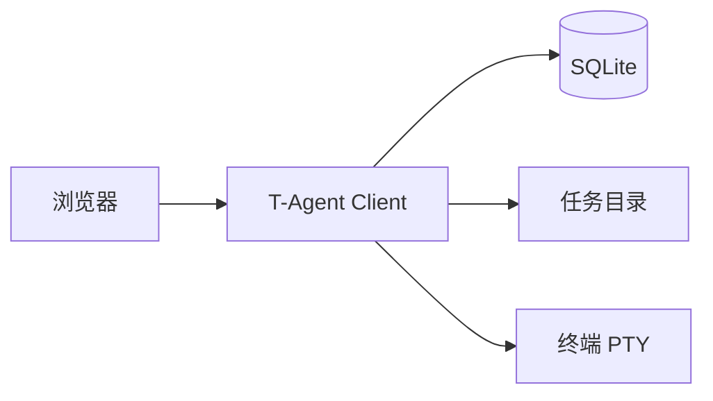

# T-Agent

终端复制：Mac 在交互式程序启用鼠标模式时，按住 Option 拖选，再用 Cmd+C 或工具栏“复制选中内容”；其他平台使用 Shift 拖选及 Ctrl+Shift+C。Ctrl+C 仍用于中断。程序发出的 OSC 52 请求不会直接写入剪贴板，需点击“查看程序复制请求”、查看内容后确认。请求最多 64 KiB、保留 60 秒，不读取系统剪贴板，也不重复处理历史回放中的请求。

Git 更新遇到本地未提交修改时，可在更新确认框勾选“强制更新”。程序先备份数据库，再将代码修改（含未跟踪且未忽略的文件）保存到 Git stash，之后快进更新；不会自动恢复修改。可用 `git stash list` 和 `git stash show -p <备份引用>` 查看备份。被 Git 忽略的配置、任务和数据库保留；已提交的分叉不会强制覆盖。配置或数据被 Git 跟踪时，会拒绝强制更新。

T-Agent 是一个面向开发任务的工作台：在浏览器里管理任务、Markdown 文档、待办事项，并为每个任务提供独立的终端会话。它以单用户 Client 方式运行，所有数据和终端都在运行 Client 的这台机器上。

## 项目架构


```mermaid
flowchart LR
    Browser[浏览器] --> Client[T-Agent Client]
    Client --> DB[(SQLite)]
    Client --> Files[任务目录]
    Client --> PTY[终端 PTY]
```

浏览器只连接 Client。需要同时使用多台机器时，在每台机器上各安装一个 Client，通过下面的“多 Client 工作台”在同一页面切换。

进一步的实现说明见 [组件架构](docs/ARCHITECTURE.md)。

## 当前功能

### Client

- 新建、编辑和删除本地任务，支持个人任务、进行中、待办、已完成分组和拖拽排序。
- 为任务管理 `DESIGN.md`、`README.md` 和 `AGENTS.md`，支持 Markdown、Mermaid、目录大纲和页面内编辑。
- 本地和分享页面采用统一的 Markdown 阅读样式：舒适的正文宽度、清晰的标题层级、可横向滚动的表格，以及带语言标识和复制按钮的深色语法高亮代码块。未标注或不支持的代码语言按纯文本展示。修改高亮模块后运行 `npm run build:markdown` 生成随应用分发的本地脚本。
- 管理任务待办事项、优先级、截止日期及工作目录。
- 每个任务支持多个独立终端，点击“新开终端”创建 Shell，并通过终端标签切换；各终端从任务工作目录启动，分别保存输出历史。
- 终端运行状态直接显示在左侧任务项和终端标签上：执行中为外圈跑马灯，完成后绿色呼吸灯等待你打开确认，详见下文“终端运行状态”。
- 从 Finder/文件管理器或 VS Code 打开本地任务目录，生成只读分享链接。
- 快捷链接栏默认隐藏，保留已有链接数据；支持 PWA 安装；电脑和手机统一使用 `/web` 的 最小宽度 1280px、大屏横向铺满、普通浏览器最大高度 1200px、安装的 Chrome 应用及全屏模式宽高随实际窗口铺满，避免窄窗口裁切终端 的桌面页面，支持浏览器缩放和手机双指缩放；旧 `/h5` 地址跳转到 `/web`。
- 自动检查更新，在设置中提示并由用户点击执行更新。

### 多 Client 工作台

打开任意 Client 的 `/clients`（例如 `http://127.0.0.1:3000/clients`），即可添加多个 Client 的名称和访问地址，在同一页面通过标签切换。地址可填写根地址或 `/web`，支持编辑、移除、单独刷新和新窗口打开。首次默认加入当前 Client，列表及最后选中的 Client 仅保存在当前浏览器，不同步到其他设备。页面本身可在登录前访问，不提供任务数据或共享登录凭证。

每个 Client 独立登录；先点击“打开并登录”，完成身份验证后返回工作台刷新。已打开的 Client 页面在切换时保留，任务选择、编辑内容和终端连接不会因切换而重新加载。刷新、修改地址或移除 Client 会关闭相应页面连接，服务端终端程序继续运行。

默认只允许同源内嵌。使用其他域名或端口的工作台时，在**目标 Client** 的 `.env` 中指定允许内嵌的工作台 origin（协议、主机及端口，不含路径），然后重启：

```dotenv
CLIENT_FRAME_ORIGINS=https://hub.example.com,http://127.0.0.1:3000
```

多个入口用英文逗号分隔，不支持通配符。Docker 在 `docker/client.env` 中设置 `T_AGENT_CLIENT_FRAME_ORIGINS` 后重新执行 Compose 创建容器。目标 Client 需要升级到 v2.14.0 或更新版本，反向代理的 CSP / X-Frame-Options 也必须允许该入口。

同一主机名下运行不同端口的多个 Client 时，Cookie 不按端口隔离。请给各 Client 分别设置不同的 `CLIENT_SESSION_COOKIE_NAME`（例如 `client-one.sid` 和 `client-two.sid`；Docker 使用 `T_AGENT_CLIENT_SESSION_COOKIE_NAME`），避免登录互相覆盖。默认仍为 `connect.sid`，更改名称后需重新登录。

同站地址可继续使用原有 Cookie；跨站内嵌要求目标 Client 使用 HTTPS，显式配置后 HTTPS 会话 Cookie 使用 `SameSite=None; Secure`，HTTP 仍使用 `SameSite=Strict`。浏览器需允许该 Client 的第三方 Cookie；HTTPS 工作台不能内嵌 HTTP Client。登录与绑定页面始终禁止内嵌，浏览器 API 和终端仍校验目标 Client 自己的 Origin。此入口不会代理 Client 请求或合并各 Client 的身份。

### 安全边界

- Client 不使用用户名密码，电脑和手机浏览器必须先绑定身份验证器，再以 6 位 TOTP 动态验证码登录；未绑定不能使用业务页面或浏览器接口。
- 首次绑定可在服务器终端执行 `node scripts/client-auth-setup.js` 完成（可通过 SSH 远程执行，Docker 在容器内执行），也可直接在网页 `/auth/setup` 扫码，本机、手机、局域网或反向代理访问均可，无需初始密码或初始化码；未绑定期间任何能访问该地址的人都可抢先绑定，请在开放网络前先完成绑定。绑定密钥加密保存，恢复码仅保存哈希；会话有效期 30 天，使用期间自动续期，支持主动退出、验证码防重放和认证限流。
- Client 默认只监听 `127.0.0.1`；手机访问需显式开放局域网监听或配置 HTTPS 反向代理。
- Client 接受任务指定的任意绝对工作目录，实际读写范围由运行 Client 的操作系统账号权限决定，建议使用权限受限的专用账号运行。

## 系统要求

- macOS 或使用主流发行版的 Linux。
- Node.js 20 或 22+；推荐 Node.js 22 LTS。
- Client 使用 Git 安装，需要系统已安装 Git。
- `better-sqlite3` 和 `node-pty` 在无法下载预编译包时需要 Python 3、make 和支持 C++20 的编译器。

macOS 可安装命令行工具：

```bash
xcode-select --install
```

Debian/Ubuntu 可安装构建依赖：

```bash
sudo apt update
sudo apt install -y git curl nodejs npm python3 build-essential clang
```

Ubuntu 20.04 默认的 GCC 9 不识别依赖使用的 `-std=c++20` 参数；安装脚本会自动安装并改用 Clang。

## 快速安装

安装脚本会询问端口和任务目录，安装依赖后注册开机自启服务。默认安装目录是当前目录下的 `t-agent`。

### 安装 Client

Client 默认端口为 `3000`。
Client 按单用户方式运行，不需要设置用户名或密码；首次打开必须绑定身份验证器。默认仅监听本机地址。

```bash
curl -fsSL https://raw.githubusercontent.com/TorinMars/t-agent/main/bootstrap.sh | T_AGENT_MODE=client bash
```

安装结束后访问：

```text
http://127.0.0.1:3000
```

macOS 会注册 `com.tagent.client` LaunchAgent，Linux 会注册 `t-agent.service`。

安装完成后，终端末尾会显示“请在浏览器打开”及访问 URL（默认 `http://127.0.0.1:3000`，以安装配置为准）。使用 `--no-service` 或系统不支持自动注册服务时，会先提示手动启动命令，启动后再访问该地址。

### 身份验证器与手机访问

新安装和旧版本升级初始都没有身份验证器绑定。再次打开客户端页面时会提示“必须绑定身份验证器”，未绑定不能访问任务、设置或终端；没有跳过绑定的免登录入口。

1. 在 Client 所在服务器终端执行 `node scripts/client-auth-setup.js`（可 SSH 登录后执行，不要求在本机操作；端口读取 `PORT`），扫描终端二维码并输入验证码；或直接打开 `/auth/setup`（本机 `http://127.0.0.1:3000/auth/setup`，或手机、局域网、反向代理地址）扫码。无需初始密码或初始化码，不限制本机或远程。已绑定后重启不会取消绑定。
2. 使用 Google Authenticator、Microsoft Authenticator 或兼容应用扫码；同一手机可点击“在身份验证器中打开”，也可手动添加密钥（基于时间、6 位、30 秒）。输入验证器生成的验证码完成绑定。
3. 下载并安全保存页面显示的 8 组一次性恢复码。恢复码只显示一次、每组只能使用一次。验证码已使用时，需等待下一组再登录另一设备。
4. 手机与 Client 在同一局域网时，将 Client `.env` 的 `HOST` 改为 `0.0.0.0` 并重启服务。手机浏览器打开 `http://电脑的局域网IP:3000/web`（端口以实际配置为准），与电脑使用相同页面。手机可双指放大缩小、拖动查看，首页 `/` 不再按设备跳转。

默认生产部署要求 HTTPS/WSS；可信内网可显式开启 `CLIENT_ALLOW_HTTP=true`。公网使用 HTTPS/WSS 反向代理，并用防火墙限制来源。身份验证器登录会话 30 天有效，使用期间自动续期，连续 30 天未使用才过期，新设备、会话过期或主动退出后需要重新验证。登录设置中可更换身份验证器；丢失验证器时使用恢复码登录并重新绑定，更换后旧验证器、旧恢复码和其他设备会话立即失效。退出登录只断开网页终端连接，不终止服务端正在运行的程序。

`SESSION_SECRET` 必须是至少 32 个字符的随机密钥，并在重启与升级间保持不变。安装脚本会自动生成；弱密钥会拒绝绑定。请随数据库安全备份该密钥，否则无法解密已有的身份验证器绑定。

### 使用 Docker 启动 Client

远程服务器一键启动（替换域名，提前安装 Docker Engine、Docker Compose v2 和 Git）：

```bash
curl -fsSL https://raw.githubusercontent.com/TorinMars/t-agent/main/docker-client.sh | bash -s -- --domain agent.example.com
```

首次安装会提示任务工作目录、宿主机端口及是否允许远程连接；已有安装可加 `--configure` 重新选择；可信内网可加 `--allow-http yes` 启用 HTTP 登录（默认关闭）。脚本准备独立 Codex 副本并等待 Client 健康，容器就绪后直接引导扫码绑定身份验证器，已有绑定则跳过，结束后显示访问地址；HTTPS 反向代理需按部署文档配置。

也可按以下步骤手动启动：

```bash
cp docker/client.env.example docker/client.env
mkdir -p "$HOME/.torin/t-agent-client/data" "$HOME/.torin/t-agent-client/tasks"
./scripts/docker-client-copy-codex.sh "$HOME/.torin/t-agent-client/codex"
docker compose --env-file docker/client.env -f compose.client.yml up -d client
```

Client 镜像默认包含 Codex，首次部署复制宿主机 `~/.codex` 到 Client 专用副本，后续更新保留副本，不与宿主机共用原目录。配置 HTTPS 反向代理后，运行 `docker compose --env-file docker/client.env -f compose.client.yml exec client node scripts/client-auth-setup.js` 完成首次绑定，再通过域名登录。完整命令、Nginx 示例、持久化与更新步骤见 [Docker Client 部署](docs/DOCKER_CLIENT.md)。

### 指定安装目录或分支

```bash
curl -fsSL https://raw.githubusercontent.com/TorinMars/t-agent/main/bootstrap.sh \
  | T_AGENT_MODE=client T_AGENT_DIR=/opt/t-agent T_AGENT_REF=main bash
```

### 从已有源码安装

```bash
chmod +x install.sh
./install.sh --mode client
```

非交互安装示例：

```bash
./install.sh --port 13500 \
  --tasks-dir /srv/t-agent-tasks
```

已有 `.env` 不会被覆盖；显式提供 `--port` 或 `--tasks-dir` 时，只修改相应配置。运行 `./install.sh --help` 可查看全部参数。

## 开始使用

### 1. 创建本地任务

打开 Client 后点击“新建任务”：

1. 填写标题；MD 文件路径和工作路径可以留空。
2. 设置优先级、分组和截止日期后创建。

路径留空时，T-Agent 会在 `TASKS_BASE_DIR` 下创建任务目录，并自动生成：

```text
任务目录/
├── DESIGN.md
├── README.md
├── AGENTS.md
└── CLAUDE.md
```

任务详情顶部可切换技术方案、README、AGENTS.md、待办和终端。终端会以该任务的工作路径作为当前目录。终端标签可切换同一任务的多个独立 Shell；页面内按任务及终端分别缓存画面、滚动位置和连接，普通切换不重复连接或重放历史，也不会终止后台程序。刷新页面后可再次选择已创建的终端。终端底部提供紧凑功能键栏：Esc、Tab、Ctrl、Command、Option、Shift、方向键、Enter 和退格。点击修饰键后再点击功能键或输入字母可组成组合键，发送一次后自动释放；“Option + ↑”按钮直接发送 Alt+Up（`ESC [ 1 ; 3 A`）。Command 使用扩展键盘协议的 Super 修饰键，需要终端内程序支持，不触发操作系统快捷键。终端顶部提供五个操作：

- “新开终端”在任务工作目录中新建独立 Shell，保留已有终端。

- “重新打开”只重新建立浏览器连接，保留当前 Shell 进程、所在目录和历史。
- “关闭当前终端”会终止当前 Shell 及其中运行的程序，并保留标签和已记录的输出历史。
- “删除当前终端”会终止新建终端的 Shell，永久删除标签和历史记录，随后切回默认终端；默认终端不能删除。
- “从工作目录重新打开”会终止当前 Shell、清空旧终端历史，并以任务配置的工作目录启动全新 Shell。

## 配置说明

复制示例配置：

```bash
cp .env.example .env
```

常用配置：

```env
PORT=3000
T_AGENT_MODE=client
SESSION_SECRET=请替换为足够长的随机字符串

# Client 内部数据归属 ID，不用于登录
SINGLE_USER_ID=local
# 默认监听本机；手机同局域网访问时可改为 0.0.0.0
HOST=127.0.0.1

# 自动创建任务文件的根目录
TASKS_BASE_DIR=/path/to/tasks
```

从旧版本升级时无需手动设置 `SINGLE_USER_ID`。程序会沿用原数据库中的首个账号作为唯一数据归属，旧 `.env` 中的 `AUTH_USERS` 可以暂时保留，但不再参与认证。

更新相关配置：

```env
GITHUB_VERSION_URL=https://api.github.com/repos/TorinMars/t-agent/contents/VERSION.json?ref=main
UPDATE_GITHUB_REPOSITORY=TorinMars/t-agent
UPDATE_GITHUB_REF=main
UPDATE_GIT_REMOTE=origin
UPDATE_GIT_BRANCH=main
UPDATE_CHECK_ENABLED=true
UPDATE_CHECK_INTERVAL_SECONDS=1800
UPDATE_CHECK_STARTUP_DELAY_SECONDS=30
```

私有仓库可在服务端设置 `GITHUB_TOKEN`。不要把 GitHub Token 写入网页代码、Nginx 配置或提交到 Git。

## 更新

Client 服务启动后会自动检查更新，之后默认每 30 分钟检查一次。发现新版本后，设置按钮会显示提示点：

1. 打开“设置”。
2. 点击“立即检查”查看版本。
3. 有新版本时点击更新按钮并二次确认。

Client 是单用户实例，设置页面中的本地用户可以执行更新。

- Git Client 会检查工作区、拉取配置分支并只执行 fast-forward 更新。
- 旧版归档 Client 会下载对应 GitHub 分支的安装包；建议先迁移为 Git 安装。
- 更新前会备份 SQLite。Git 安装的纯前端、静态资源和文档更新会直接完成，不安装依赖、不重启服务，也不自动刷新页面，保留现有 Shell 连接；用户可稍后刷新加载新界面。
- 服务端、依赖、构建脚本或 API/数据库版本变化时，仍安装依赖、校验 `node-pty`、构建前端资源并重启服务。确认界面会说明是否需要重启。归档安装仍使用完整更新流程。
- 更新范围与当前进程启动时的提交比较，避免上次失败后遗留的服务端变化被误判为无需重启。
- `.env`、数据库、日志以及任务目录不会被更新覆盖。

Git 工作区存在未提交修改或本地分支已经分叉时，网页更新会停止，防止覆盖本地代码。

更新过程会在服务日志中输出带 `[update]` 前缀的时间、阶段、命令耗时，以及 npm 安装和前端构建的实时输出；失败时记录退出码和错误详情。PM2 部署可用 `pm2 logs t-agent` 查看（使用部署时的 `PM2_HOME`），systemd 部署可查看对应服务的 journal 日志。在线更新需要的 `esbuild` 随正式依赖安装，生产环境省略开发依赖也能完成构建。

### 手动更新 Git Client

```bash
cd /path/to/t-agent
git pull --ff-only origin main
npm ci --ignore-scripts=false
npm run build:monaco
node scripts/verify-node-pty.js
```

然后按当前系统重启服务，浏览器使用 `Command/Ctrl + Shift + R` 强制刷新静态资源。

### 将安装包迁移为 Git 安装

新版安装目录可直接使用通用迁移脚本。脚本会保留 `.env`、`data/`、`logs/` 和 `tasks/`，并把原安装完整备份到同级目录：

```bash
T_AGENT_REF=main ./scripts/migrate-to-git.sh
```

旧安装包中还没有通用脚本时，可以先从目标分支下载脚本到当前项目的 `scripts/` 目录。迁移期间 systemd 或 launchd 服务会自动停止并重新注册；没有 systemd 的 Linux 环境需要先手动停止当前进程。确认新安装的配置和任务正常后，再自行处理备份。

## 服务管理

### macOS

macOS 没有 `systemctl`，请使用 `launchctl`：

```bash
launchctl kickstart -k "gui/$UID/com.tagent.client"
```

查看日志：

```bash
tail -f logs/stdout.log logs/stderr.log
```

### Linux systemd

```bash
sudo systemctl status t-agent
sudo systemctl restart t-agent
```

查看日志：

```bash
sudo journalctl -u t-agent -f
```

### Linux 容器或未运行 systemd

有些 Ubuntu 容器虽然安装了 `systemctl`，但 PID 1 不是 systemd。安装脚本会自动识别这种环境、跳过服务注册，并显示手动启动命令。Client 可以前台运行：

```bash
cd /path/to/t-agent
npm start
```

生产环境可以使用 [Docker Client 部署](docs/DOCKER_CLIENT.md)，或者把上面的命令交给已有的进程管理器托管。临时后台运行可以使用：

```bash
cd /path/to/t-agent
nohup npm start >> logs/stdout.log 2>> logs/stderr.log &
```

## 手动启动和开发

安装依赖：

```bash
npm install
```

启动完整 Client：

```bash
npm start
# 等价于 npm run start:client
```

运行测试：

```bash
npm ci --include=dev
npx playwright install chromium
npm test
```

Playwright 固定为兼容 macOS 13 的 1.58.2。全量测试包含真实 Chromium 浏览器回归，开发依赖包含 Playwright、xterm 及 Fit 插件。多 Client 回归使用 OpenSSL 生成临时自签名证书，并启动本地 HTTPS 代理验证跨站 Cookie 和同主机不同端口的会话隔离；测试结束后删除临时证书和数据。Linux CI 可使用 `npx playwright install --with-deps chromium` 安装系统依赖；也可通过 `CHROME_PATH` 指定现有 Chromium 可执行文件。

多 Client 浏览器回归单独运行 `node scripts/test-client-switcher-browser.cjs`。本机 Chrome 151.0.7922.72 的无界面模式存在内嵌窗口底部点击的自动化差异；Playwright 对应 Chromium 145 和同版 Chrome 实际窗口回归均通过。使用该系统 Chrome 复核时可设置 `HEADFUL=true CHROME_PATH="/Applications/Google Chrome.app/Contents/MacOS/Google Chrome"` 运行脚本。

默认访问地址为 `http://127.0.0.1:3000`。

## 常见问题

### `node-pty 未安装` 或 `posix_spawnp failed`

```bash
npm ci --ignore-scripts=false
node scripts/verify-node-pty.js
```

如果校验仍失败：

```bash
npm rebuild node-pty --ignore-scripts=false --foreground-scripts
node scripts/verify-node-pty.js
```

macOS 请先确保已安装 Xcode Command Line Tools，然后重新运行安装脚本。

### Linux 安装时报 `unrecognized command line option '-std=c++20'`

这表示 npm 未能下载原生模块的预编译包，回退源码编译后发现系统 `g++` 版本过旧。新版安装脚本会在 Debian/Ubuntu 上自动选择 Clang，在 CentOS/RHEL 上尝试安装 GCC Toolset。已有安装目录可以直接重新运行。即使上次失败时已经创建 `.env`，只要数据库从未生成过 Token，安装成功后仍会补发初始 owner Token：

```bash
cd /path/to/t-agent
./install.sh
```

Ubuntu 20.04 也可以手动安装 Clang 后重试：

```bash
sudo apt update
sudo apt install -y clang python3 make

cd /path/to/t-agent
CC=clang CXX=clang++ ./install.sh
```

CentOS/RHEL 8 系统也可以手动安装 GCC Toolset 12 后重试：

```bash
sudo dnf install -y gcc-toolset-12-gcc gcc-toolset-12-gcc-c++
export CC=/opt/rh/gcc-toolset-12/root/usr/bin/gcc
export CXX=/opt/rh/gcc-toolset-12/root/usr/bin/g++

cd /path/to/t-agent
./install.sh
```

`prebuild-install` 的 deprecated 警告和 npm 新版本提示不是此次编译失败的原因。

### 日志反复出现 `VERSION_URL_NOT_CONFIGURED`

在 `.env` 中补充 `GITHUB_VERSION_URL` 和更新仓库配置，或暂时关闭检查：

```env
UPDATE_CHECK_ENABLED=false
```

修改 `.env` 后需要重启服务。

## 数据与备份

建议备份：

```text
.env             # 单用户 ID、SESSION_SECRET、更新来源
data/            # SQLite、会话和更新状态
tasks/           # 默认任务工作目录；自定义目录需单独备份
logs/            # 可选，运行日志
```

不要只复制 `data/` 而丢失 `.env`，否则 Client 可能无法解密已经保存的身份验证器绑定。

## 卸载

以下操作会停止服务并永久删除安装目录、配置、数据库、日志和默认任务目录。脚本会先列出目标，并要求输入 `UNINSTALL` 确认：

```bash
curl -fsSL https://raw.githubusercontent.com/TorinMars/t-agent/main/uninstall.sh | bash
```

自定义安装目录：

```bash
curl -fsSL https://raw.githubusercontent.com/TorinMars/t-agent/main/uninstall.sh \
  | T_AGENT_DIR=/opt/t-agent bash
```

## 目录结构

```text
t-agent/
├── db/               # SQLite Schema 和会话存储
├── docs/             # 架构及 Docker 部署文档
├── lib/              # 版本、终端历史等基础组件
├── middleware/       # Session 与登录鉴权
├── public/           # Client 前端静态资源
├── routes/           # HTTP/WebSocket 路由
├── scripts/          # 迁移、构建和诊断脚本
├── services/         # 任务、终端及更新业务组件
├── data/             # 运行数据，不提交 Git
├── logs/             # 服务日志，不提交 Git
└── tasks/            # 默认任务工作目录，不提交 Git
```

## License

仓库暂未声明开源许可证。未经授权，请勿假定代码可以被复制、分发或用于商业发布。

设置按钮左侧的“一键更新”会立即检查客户端新版本，并在可更新时直接执行，无需二次确认；更新中禁用重复点击。仅前端变更保持 Shell 连接，需要服务端变更时按更新流程重启。工作区冲突等阻断会显示原因，不自动强制覆盖。

任务文档默认使用工作目录下的 `DESIGN.md`、`README.md` 和 `AGENTS.md`，已有文件直接读取，缺失时才创建，绝不覆盖已有内容。默认 `DESIGN.md` 随工作目录变化；旧任务指向其他目录的默认 `DESIGN.md` 也按当前工作目录解析，旧文件保留。手动指定其他文件名的技术方案路径继续使用自定义文件。

任务编辑支持分别设置技术方案、README、AGENT 三个文件的绝对路径。显式路径优先于工作目录默认值（包括其他目录中的 DESIGN.md）；清空后恢复默认。切换路径不会移动或覆盖旧文件，目标不存在时创建。

### Agent 规则文件兼容

新任务默认创建 `AGENTS.md` 和 `CLAUDE.md`，后者通过 `@AGENTS.md` 引用主规则。已有 `CLAUDE.md` 保留内容并补齐引用。启动时迁移已有任务：仅有 `AGENT.md` 时改为 `AGENTS.md`；两者并存时保留 `AGENTS.md` 并删除 `AGENT.md`。旧的显式 `AGENT.md` 路径也同步迁移，其他自定义规则路径保持原样，工作目录仍补齐标准规则入口。不可访问的工作目录记录错误并在下次启动重试，不会重建不存在的旧目录。

### 任务文件浏览器

选中任务后，点击顶部“文件浏览器”打开目录树和代码编辑器。页面自动切到终端，文件面板从上向下展开，默认占工具栏下方高度的 85%，底部终端仍可输入；拖动面板底边可调整比例，拖动目录树右边缘可调整树宽度。再次点击按钮或“收起”恢复完整终端，不会关闭 Shell。

面板支持多个文件标签、新建文件和文件夹、重命名、确认删除，以及显示隐藏文件。范围限于当前任务工作目录；符号链接只显示，不展开或操作。仅编辑不超过 5 MiB 的 UTF-8 文本，保留原有 BOM、换行符和权限。文件修改后点击保存或按 Ctrl/Cmd+S；离开未保存文件时可保存、放弃或取消。文件被终端或 Agent 修改后，保存会提示冲突，可重新加载或确认覆盖。

文件请求沿用任务归属检查。该版本不提供上传下载、Git 面板和全项目搜索。

### 终端图片上传（阿里云 OSS）

在 Client 的设置中配置阿里云 OSS 并启用后，可在任务终端直接粘贴图片，电脑和手机也都可使用终端底部的“上传图片”按钮选择图片（手机可从相册选择）。支持 PNG、JPEG、GIF、WebP，单张不超过 10 MiB。上传期间全页显示蒙版和进度条，禁止终端输入、切换任务等操作；上传完成后自动把图片 URL 填入原终端，不自动回车。失败后解除蒙版并显示原因。

填写 Bucket、Region（例如 `oss-cn-hangzhou`）、AccessKey ID、AccessKey Secret 和对象前缀。建议为专用 RAM 用户授予该前缀的 `oss:PutObject` 与 `oss:GetObject` 权限。图片由 Client 服务端上传，不需要向浏览器提供 OSS 密钥，也不需要配置浏览器直传 CORS。密钥加密保存在 Client 数据库，修改配置时密钥留空会保留已保存的值；备份数据库时请同时保留 `SESSION_SECRET`。Docker 更新保留 Client 数据目录及该密钥即可沿用配置。

默认返回有效期 24 小时的私有对象签名链接。需要长期有效的链接时，可填写已配置公开读取的 HTTPS 访问地址（如自己的 CDN 地址）；程序不会修改 Bucket 的访问权限。签名链接在有效期内可被持有者读取，过期后需重新取得链接；图片对象不会自动删除，可在 OSS 中配置生命周期规则。服务端反向代理需允许至少 10 MiB 的请求体（Nginx 可设 `client_max_body_size 12m;`）。

安装版应用与网页使用同一套 OSS 设置。保存凭据后需勾选“启用图片上传”；未启用时保存页面会明确提示。应用重新获得焦点或回到前台时刷新配置，首次读取失败可在上传时重试，终端上传按钮不会因配置读取失败而隐藏。不同 Client 的 OSS 配置仍各自独立。

### 可信内网直接访问 Client

Docker 安装可在更新源码后执行 `./docker-client.sh --remote-access yes --allow-http yes`，使用远程镜像重建并保留验证器及数据，然后通过 `http://内网IP:端口/auth/login` 登录。首次安装或 `--configure` 也会询问此选项，默认要求 HTTPS。原生安装对应 `CLIENT_ALLOW_HTTP=true`。HTTP 不加密验证码和会话，需自行限制访问来源；详细步骤见 [内网 HTTP 登录](docs/DOCKER_CLIENT.md#可信内网-http-登录)。

### 终端历史按需恢复

刷新页面或重新连接终端时，先恢复当前画面和最近 500 行滚动历史，不再把完整日志一次性传到浏览器回放。服务端保留终端的光标、颜色和全屏程序状态；实时输出继续正常显示。页面内普通切换任务或终端仍复用已打开的实例。

点击终端工具栏的“历史记录”按需查看保留日志，继续加载更早内容。历史窗口是独立的只读文本，不会把旧输出及其清屏、光标控制指令写回正在使用的终端。首次打开从这次连接时的日志末尾开始，因此会包含最近内容；连接后的新输出仍显示在主终端。每页最多 500 行并限制传输大小，服务器继续沿用现有约 5 MB 日志保留上限。


### 终端运行状态

服务端为每个终端判定 `idle` / `running` / `done` 三种状态，浏览器每 1.5 秒轮询 `GET /api/tasks/terminal-activity`，刷新页面后状态不会丢失：

- **执行中（running）**：左侧任务项和对应终端标签的外圈出现跑马灯。左侧任务项汇总该任务所有终端，任一终端执行中即显示。
- **完成待确认（done）**：绿色呼吸灯，一直保持到你打开该终端。正在查看该终端、切到它所在的标签或切回浏览器窗口，都算确认（`POST /api/tasks/:id/terminal/ack`）。后台终端完成后不会被其他终端的确认吞掉。
- 系统设置了“减少动态效果”时，两种效果都不再动画。

判定方式按前台进程区分：

| 前台程序 | 判定依据 |
| --- | --- |
| 普通命令（`make`、`npm test` 等） | 占据 PTY 前台即执行中，静默也保持；回到 shell 提示符即完成。约 1 秒内结束的命令不显示 |
| Claude Code、Codex 等 Agent | 优先使用它们的 hook 上报：提交提示为开始、一轮结束为完成、需要权限确认时显示完成待确认，你回应后继续工作会自动回到执行中 |
| 没有 hook 的 Agent，以及 `ssh`、`tmux`、`vim` 等交互程序 | 按输出判断：1.5 秒内连续多次输出为执行中，静默约 3 秒视为在等你；你自己的按键回显和调整窗口后的重绘不计入 |

Agent 中途按 Esc 或 Ctrl+C 中断时不会触发结束 hook，此时执行中且静默超过 20 秒会自动视为完成。

**Hook 上报**：终端 PTY 的环境里有 `TA_HOOK_URL` 和 `TA_HOOK_TOKEN`（token 按任务和终端用 HMAC 计算，只存在于那个 PTY 中），hook 命令只在 `TA_HOOK_URL` 存在时才用 `curl` 上报到 `POST /hooks/terminal-activity`；在普通终端里运行同一份配置不会有任何动作，服务不可达时也不会阻塞 Agent。hook 配置在 `rules/claude/settings.json` 和 `rules/codex/hooks.json`，由下文的“用户级规则与默认配置同步”合并到本机，本机已有的 hook 保留。

- 在目标机器上运行一次 `ta`（或带同步函数的 `claude` / `codex`），配置才会写入 `~/.claude/settings.json` 和 `~/.codex/hooks.json`。
- Codex 要求审核并信任 hook：首次进入 Codex 后输入 `/hooks` 批准，未批准前 Codex 不会执行。
- 通过 ssh 进入远程机器再运行 Agent 时，环境变量不会带过去，这种情况按输出判断。
- 依赖 `curl`；Docker Client 镜像已包含。

## 开发环境安装脚本

页面顶部“实用工具”标签复制的命令会运行 `scripts/install-claude-code.sh`，适用于 macOS 和 Linux，全部装在当前用户目录，不使用 Homebrew、不执行 `sudo`：

1. 检查系统、架构、`curl`/`wget`、`tar`、`git`、能否访问 `claude.ai` 与 `github.com`。
2. 安装 Claude Code（官方原生安装器）；已安装则跳过。
3. 安装 Codex：优先下载 GitHub 发布页的预编译二进制，失败时回退到 `npm install -g --prefix ~/.local @openai/codex`。
4. 没有 SSH 密钥时生成 `ed25519` 密钥（默认无密码短语）并只显示公钥；已有任何密钥都不会覆盖。
5. 安装同步程序到 `~/.local/share/t-agent/agent-sync.py`，先同步一次，并在 shell 配置里写入 `claude` / `codex` 包装函数（详见下节“用户级规则与默认配置同步”）；`--skip sync` 跳过，`--no-modify-path` 时只同步一次、不写包装函数。
6. 安装统一命令 `ta` 到 `~/.local/bin/ta`（详见下节“统一命令 ta”）；`--skip ta` 跳过，已有的其他同名程序不会被覆盖。
7. 安装 PM2（详见下节“PM2 进程管理”）；`--skip pm2` 跳过。
8. 加 `--with-apps`（仅 macOS 本机桌面会话）时，下载并安装 Maccy、Snipaste、Clash Verge Rev：均为 Apple 公证的官方包，安装前校验代码签名和系统版本要求，默认装到 `/Applications`（不可写时用 `~/Applications`，也可用 `--apps-dir` 指定）；已安装的跳过，SSH 远程登录时自动跳过。首次打开所需的“辅助功能”“屏幕录制”授权需要手动完成。
9. 把 `~/.local/bin` 追加到 shell 配置文件（只追加一次），最后汇总每一项的结果；任一项失败时退出码为 1。

参数：`--check`（只检查）、`--upgrade`、`--no-modify-path`、`--passphrase`、`--skip claude|codex|ssh|sync|ta|pm2`、`--with-apps`、`--apps-dir DIR`，例如 `curl -fsSL <脚本地址> | bash -s -- --check`。

## 代理安装与订阅配置

“实用工具”页的“配置代理”命令运行 `scripts/install-proxy.sh`，只提示输入订阅链接，不需要 `sudo`：

- **macOS（默认）**：检查已安装 Clash Verge（可先用 `install-claude-code.sh --with-apps` 安装），用 `clash://install-config` 深链接把订阅导入 Clash Verge；“系统代理”开关需要在应用里手动打开。
- **Linux / macOS 加 `--core`**：下载最新 mihomo 内核到 `~/.local/bin`，拉取订阅到 `~/.config/mihomo/config.yaml`，强制只在本机监听（混合端口默认 7890、控制接口默认 127.0.0.1:9090，可用 `--port`、`--controller-port` 修改），校验配置后以 `systemd --user` 服务运行；没有 systemd 用户服务时退回后台进程。同时生成 `~/.config/mihomo/proxy-env.sh`，`source` 后用 `proxy_on` / `proxy_off` 切换当前终端的代理环境变量。
- **订阅链接**：只从终端隐藏输入（无终端时读取 `T_AGENT_PROXY_SUB_URL`），保存到权限 600 的文件，不打印、不出现在进程参数或日志里。订阅内容必须是 Clash/mihomo 格式，否则会给出提示。
- 其他参数：`--update`（用已保存的订阅重新拉取并重启）、`--status`、`--reconfigure`、`--upgrade`、`--no-service`。

## 本地安装向导

“实用工具”页的“复制向导启动命令”运行 `scripts/setup-wizard.sh`：下载 `setup-wizard.py`、`setup-wizard.html` 和两个安装脚本到临时目录（退出后删除），启动一个网页向导，可以勾选开发环境、Mac 应用，填写订阅链接并实时查看输出。需要 Python 3.6+（只用标准库），参数：`--port N`（默认 8765）、`--no-browser`、`--idle-timeout 秒`。

安全约束：
- 只监听 `127.0.0.1`。远程服务器上运行时，按终端提示在自己的电脑上执行 `ssh -L 8765:127.0.0.1:8765 <用户名>@<服务器>`，再用浏览器打开打印出的地址。
- 每次启动生成随机令牌，页面加载后从地址栏抹掉；所有接口都校验令牌、`Host` 和 `Origin`，POST 只接受 JSON，不写访问日志。
- 只能运行两个安装脚本，参数由白名单构造，页面不能提交任意命令；同一时间只运行一个任务。
- 订阅链接只经环境变量交给子进程，输出中自动替换为 `***`，服务端不保存；页面提交后立即清空输入框。
- 30 分钟无操作（且没有任务在运行）自动退出，页面上也可以点“退出向导”。

## 用户级规则与默认配置同步

`scripts/agent-sync.py`（安装脚本会装到 `~/.local/share/t-agent/`）在每次启动 `claude` / `codex` 前，从本仓库 `rules/` 目录拉取用户级规则和默认配置并合并到本机，详见 `rules/README.md`。当前默认值：

- Claude Code：模型 `sonnet`，`permissions.defaultMode = auto`（自动审核权限请求），以及终端状态上报 hook。
- Codex：模型 `gpt-6-sol`，`approval_policy = on-request`、`approvals_reviewer = auto_review`、`sandbox_mode = workspace-write`（等价于 `--approve-for-me`）；另有 `~/.codex/hooks.json` 中的终端状态上报 hook（JSON 递归合并，需在 Codex `/hooks` 中信任一次）。

要点：
- 规则文件只替换 `<!-- t-agent:managed:begin/end -->` 区块，区块外的本机规则保留；配置只覆盖远程列出的键，本机其他键、注释、`[表]` 保留；第一次修改前留 `.t-agent.bak` 备份。
- 触发方式是 shell 函数：`claude() { …同步…; command claude "$@"; }`，`codex` 同理。`codex` 函数还让 `codex -c` / `codex --continue [提示词]` 和 `claude -c` 一样继续当前目录最近一次会话（等价于 `codex resume --last`）；`codex -c key=value` 仍是原来的配置覆盖，其余参数原样透传。t-agent 网页终端启动的是交互式 shell，同样生效；不经过 shell 直接执行二进制则不会触发。
- 联网带 ETag 条件请求、总时限约 5 秒；失败后 10 分钟内不再联网，改用上次缓存，永远不会阻止工具启动。GitHub 不可达时，每 10 分钟最多有一次约 3 秒的延迟。
- 想让某台机器的某些键固定为不同的值：在该机器创建 `~/.config/t-agent/overrides/claude/settings.json` 或 `codex/config.toml`（格式同远程文件，只写要固定的键），覆盖优先于远程，详见 `rules/README.md`。
- 本机文件损坏（无法解析）时不覆盖，只提示。远程改动推送到 `main` 后，各机器下次启动工具时生效。
- 撤销：删除 shell 配置里 `# >>> t-agent agent-sync >>>` 到 `# <<< t-agent agent-sync <<<` 之间的内容即可。

## 统一命令 ta

`ta` 是一个不依赖 shell 配置的独立脚本（`scripts/ta.sh`，安装到 `~/.local/bin/ta`），只用记这一个命令：

| 命令 | 实际执行 |
|---|---|
| `ta` | `claude`（默认工具） |
| `ta x` / `ta codex` | `codex` |
| `ta -c` | `claude -c`（继续当前目录最近会话） |
| `ta x -c` | `codex resume --last` |
| `ta -p "提示词"` | `claude -p "提示词"`（非交互执行） |
| `ta x -p "提示词"` | `codex exec "提示词"` |
| `ta x -c -p "提示词"` | `codex exec resume --last "提示词"` |
| `ta -m opus` / `ta x -m gpt-6-sol` | `claude --model opus` / `codex -m gpt-6-sol` |

- 工具名可写 `claude`（`c`）或 `codex`（`x`）；不写时用默认工具，`ta --set-default codex` 修改（保存在 `~/.config/t-agent/default-tool`，环境变量 `TA_DEFAULT_TOOL` 优先）。
- 只有 `-c/--continue`、`-p/--prompt`、`-m/--model` 会被翻译，其余参数原样透传；两边同名但含义不同的参数（如 codex 的 `-p` 是 `--profile`）写在 `--` 之后：`ta x -- -p 名称`。
- `ta --dry-run …` 只打印将要执行的命令。启动前同样会同步远程规则与配置（失败或没有 Python 不影响启动）。
- 原来的 `claude` / `codex` 命令保持可用。

## PM2 进程管理

**安装**：`install-claude-code.sh` 的 PM2 步骤在 `pm2` 已存在时直接跳过。没有 Node.js 时，下载官方 Node 22 LTS 预编译包（`https://nodejs.org/dist/latest-v22.x/`）到 `~/.local/node`，用官方 `SHASUMS256.txt` 校验 SHA-256（不一致则拒绝安装），并把 `~/.local/node/bin` 写入 shell 配置；国内网络可设置 `T_AGENT_NODE_MIRROR=https://npmmirror.com/mirrors/node`。随后 `npm install -g pm2`（全局目录不可写时改装到 `~/.local`）。不使用 sudo；Alpine 等 musl 系统不适用官方包，会提示改用系统包。开机自启需要你自己执行 `pm2 startup`（其中的 sudo 命令由 pm2 打印）和 `pm2 save`。

**网页管理**：t-agent 的“实用工具”页有“PM2 进程管理”面板，列出运行 Client 的这台机器上的 PM2 进程（名称、状态、CPU、内存、运行时长、重启次数），支持启动、停止、重启、reload 和查看/自动刷新日志。接口是 `/api/pm2/*`，和其他 `/api/*` 一样需要登录并校验来源。

安全约束：
- 只允许 `start`、`stop`、`restart`、`reload` 四个动作，不能删除进程、不能启动任意命令；进程编号必须存在于 `pm2 jlist` 中。
- 返回字段是白名单，**不返回进程的环境变量和命令行参数**；日志路径只取自 pm2 自己的记录，不接受请求传入的路径，最多读取尾部 256 KiB / 1000 行。
- 停止任意进程、重启或停止当前页面所在的 t-agent 自身都会二次确认。
- PM2 守护进程没有运行时只显示提示，不会因为查询而把它拉起来。
- 管理范围只有运行 Client 的这台机器。
